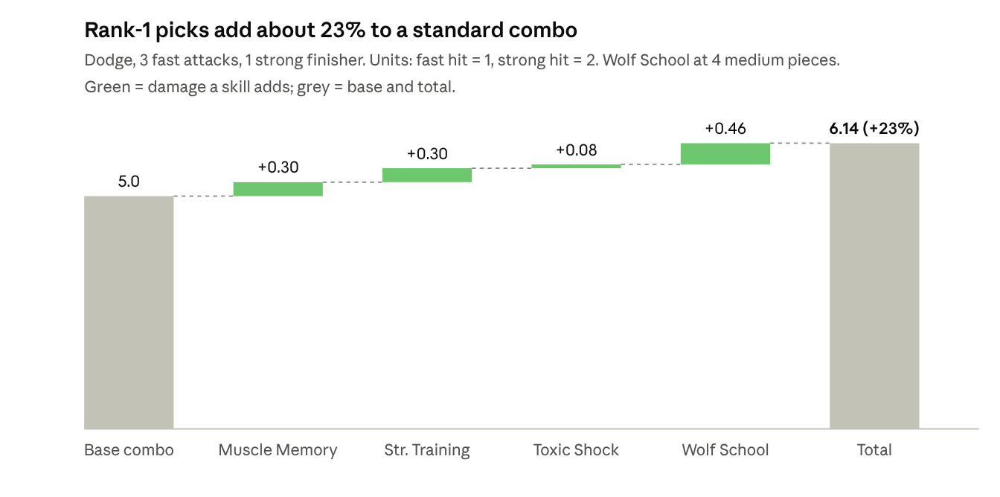

# Witcher 3 Remastered: Spellsword Alchemist Build

As of Oct 8, 2026 · patch 5.0 (Remastered)

## How the 5.0 tree works

This is a sword-first build that uses Signs to set up hits and Alchemy for healing and poison. It is designed to carry you through the main game and both expansions, not to min/max Death March.

- **Prerequisites, not point totals.** A skill unlocks once you own one connected skill before it. Rank 1 of the prerequisite is enough.
- **Three ranks per skill.** Each rank costs one point.
- **Branch passives.** Every point in Combat raises Adrenaline gain (+1%). Signs raises combat Stamina regen (+0.5%). Alchemy raises potion duration and bomb damage (+2%). General raises Vitality (+1%).
- **Equip to use.** Bought skills still have to be slotted on the character screen to work.
- **Mutagen colors.** Red goes with Combat skills, blue with Signs, green with Alchemy. Synergy now sits in the General tree.
- **School Techniques.** All six are starting nodes in General, so you can pick yours on the first point.

The point plan below assumes about one point per level, plus whatever Places of Power give you. Find those and you just move faster through the phases.

## Build concept and gear

**Wear medium armor and take Wolf School Techniques.** Each medium piece adds 2% weapon damage and 2% Sign intensity, so it is the only school bonus that feeds both halves of a hybrid.

| Role | Tree | Core skills |
| --- | --- | --- |
| Damage | Combat | Muscle Memory, Strength Training, Three Strikes |
| Setup and defense | Signs | Quen (Exploding/Active Shield), Igni (Melt Armor), Yrden (Magic Trap) |
| Sustain and poison | Alchemy | Refreshment, Poisoned Blades, Toxic Shock |
| Glue | General | Wolf School Techniques, then Adrenaline Burst and Synergy |

- **Base game armor:** any medium armor until you get a full witcher set. The Griffin set is the base-game medium witcher set.
- **Blood and Wine:** the Forgotten Wolven set (quest *In the Eternal Fire's Shadow*) is built for sword-and-Sign play.
- **Swords:** whatever has the highest damage. Don't hold onto a weak sword just because it matches a set.

## Spend your 7 points now (level 6)

Put most of the early points into your sword, keep Quen up, add Igni, and take Delusion for the dialogue options.

- [ ] **Muscle Memory → rank 2** (Combat, 2 pts). After a dodge or roll, your next fast attack does +30% damage. This is the starting node of the Combat path.
- [ ] **Strength Training → rank 1** (Combat, 1 pt). Fast attacks boost your next strong attack by 15%. Requires Muscle Memory.
- [ ] **Exploding Shield → rank 1** (Signs, 1 pt). When Quen breaks, it knocks enemies back. Leads to Active Shield later.
- [ ] **Melt Armor → rank 1** (Signs, 1 pt). Igni strips armor and gets +10% Burn chance. Leads to Firestream.
- [ ] **Delusion → rank 2** (Signs, 2 pts). Unlocks the Axii dialogue options you want, and stops the target from closing in while you cast Axii. It's a starting node, so it costs only the two points.

Refreshment moves to the start of Phase 1 to make room for Delusion.

Wait on Wolf School Techniques until you're wearing medium armor. Before then it gives you nothing. If you're already in medium armor, take it instead of Muscle Memory's second rank.

**Slots at level 6.** Five skill slots are open at level 6. This plan uses exactly five distinct skills. The second ranks of Muscle Memory and Delusion don't need slots of their own. Arrange them so each mutagen sits next to skills of its color:

| Slot group | Skills | Mutagen |
| --- | --- | --- |
| Group with 3 open slots | Muscle Memory, Strength Training, Melt Armor | Red if you have one |
| Group with 2 open slots | Exploding Shield, Delusion | Blue: both are Signs skills, so you get the full bonus |

**Later phases buy more skills than you have slots.** Stepping-stone skills that you only buy to unlock the next one stay unequipped: Sustained Glyphs, Sun and Stars, Hunter Instinct, Survival Instinct, Supercharged Glyphs, Frenzy. When a new slot opens, fill it from the "What to equip" order below.

## Leveling roadmap

Buy each phase from the top down. Every skill's prerequisite is either already bought in an earlier phase or listed higher up in the same table.

### Phase 1: levels 7–14 (about 8 points)

| Skill | Tree | Take to | Requires | Why |
| --- | --- | --- | --- | --- |
| Three Strikes | Combat | 1 | Muscle Memory | Chance to power up the next attack in a string |
| Razor Focus | Combat | 1 | Three Strikes | Start fights with 1 Adrenaline, +10% Adrenaline from hits |
| Sustained Glyphs | Signs | 1 | — (start) | Longer Signs, extra trap charges |
| Magic Trap | Signs | 1 | Sustained Glyphs | Yrden alt mode damages and slows in a 14-yard radius; key against wraiths |
| Frenzy | Alchemy | 1 | — (start) | Slow-mo before enemy counters once you've drunk a potion |
| Wolf School Techniques | General | 1 | — (start) | Take it once you're in medium armor |
| Exploding Shield | Signs | 2 | — | Stronger knockback |

### Phase 2: levels 15–22 (about 8 points)

| Skill | Tree | Take to | Requires | Why |
| --- | --- | --- | --- | --- |
| Poisoned Blades | Alchemy | 1 | Frenzy | Oiled blades can poison |
| Toxic Shock | Alchemy | 1 | Poisoned Blades | A strong attack on a poisoned target bursts for +25% poison damage |
| Undying | Combat | 1 | Three Strikes | Spends Adrenaline to bring you back from 0 Vitality |
| Active Shield | Signs | 1 | Exploding Shield | Quen alt mode heals you as it absorbs damage |
| Supercharged Glyphs | Signs | 1 | Magic Trap | Enemies in Yrden take damage every second |
| Muscle Memory | Combat | 3 | — | Rank up your main damage skill |
| Strength Training | Combat | 2 | — | Bigger strong-attack finisher |

### Phase 3: levels 23–30 (about 8 points)

| Skill | Tree | Take to | Requires | Why |
| --- | --- | --- | --- | --- |
| Catalyst | Signs | 1 | Supercharged Glyphs | Igni and Aard +30% intensity inside Yrden |
| Hunter Instinct | Alchemy | 1 | Refreshment | +20% crit damage at full Adrenaline with the right oil |
| Acquired Tolerance | Alchemy | 1 | Hunter Instinct | +1 max Toxicity per recipe known, so you can drink more |
| Sun and Stars | General | 1 | Wolf School Techniques | Regen; mainly a stepping stone |
| Survival Instinct | General | 1 | Sun and Stars | +8% max Vitality |
| Adrenaline Burst | General | 1 | Survival Instinct | Signs generate Adrenaline |
| Three Strikes, Wolf School Techniques | Combat / General | 2 each | — | Rank-ups |

### Phase 4: level 30+ and Blood and Wine

- [ ] **Focus** (Signs, needs Catalyst): +10% Sign intensity per Adrenaline point you're holding.
- [ ] **Tissue Transmutation** (Alchemy, needs Acquired Tolerance): decoctions give +300 max Vitality.
- [ ] **Anger Management → Synergy** (General, needs Survival Instinct): cast Signs with Adrenaline when out of Stamina, then stronger mutagen bonuses.
- [ ] **Chain Reaction → Aftershock → Resonance** (Signs, needs Catalyst): after you cast a Sign, your next three melee hits deal bonus damage. This is the hybrid capstone.
- [ ] **Rank-ups:** Wolf School Techniques 3, Toxic Shock, Active Shield, Catalyst, Melt Armor.
- [ ] **Blood and Wine:** research Mutations for four extra skill slots. Conductors of Magic is the hybrid mutation; it adds 50% of your drawn sword's damage to Signs.

## What to equip

When there are more skills than open slots, equip them in this order.

1. Muscle Memory
2. Strength Training
3. Exploding Shield, then Active Shield once you have it. Delusion goes in the same group and stays slotted, so its dialogue options show up.
4. Melt Armor
5. Refreshment
6. Wolf School Techniques (once you're in medium armor)
7. Magic Trap
8. Three Strikes
9. Toxic Shock
10. Undying
11. Razor Focus
12. Catalyst, then Focus or Resonance

**Mutagens:** match each mutagen to the color of the skills slotted next to it. That will mostly be red (Combat) and blue (Signs), with green if you put more into Alchemy. Synergy makes every slotted mutagen stronger.

## Combat loop

The basic rhythm is: Sign, dodge, three fast attacks, then a strong attack to finish.

1. **Before the fight:** put on the right oil for the monster type and drink your potions. Oils feed Poisoned Blades and Hunter Instinct, and drinking any potion turns Frenzy on.
2. **Open:** cast Quen. Against groups or wraiths, lay down a Magic Trap. Once you have Catalyst, fight inside it.
3. **Soften up:** hit armored targets with Igni so Melt Armor strips their armor.
4. **Punish:** dodge or roll, then land fast attacks. Muscle Memory and Three Strikes both trigger here.
5. **Finish:** end on a strong attack. It uses the Strength Training stack, and if the target is poisoned it also triggers Toxic Shock.
6. **Recover:** when Quen breaks, recast it. If you're low on health, drink a potion; Refreshment heals 10% per dose.

**Consumables to keep crafting:** Swallow (healing), Thunderbolt (attack power), Tawny Owl (Stamina for Signs), and the right oil for each monster type.

**Adrenaline:** don't spend it. Undying and, later, Focus both work best with points banked. Rend and Whirl spend Adrenaline, which is why this build leaves them out.

## Skip list and respec

**Skip for this build:**

- **Arrow Deflection / Cold Blood / crossbow branch.** Only worth it if the crossbow is part of how you fight. Note that Resolve sits on this branch, which is why it isn't in the plan.
- **Fleet-Footed → Whirl.** The chain is long and Whirl burns Adrenaline.
- **High Tolerance.** You take 150% damage at 80%+ Toxicity, which is too risky for a build meant to play steadily.
- **Pyrotechnics, Cluster Bombs, bomb-focused General skills.** Only worth it if you want to play around bombs.

**Respeccing:** a Potion of Clearance refunds your skill points. Keira Metz sells it, and it usually costs about 1,000 crowns. Two good moments to respec:

- **Blood and Wine.** Rebuild around a mutation, either Conductors of Magic for Signs or Euphoria if you want to go full Alchemy.
- **If a fight style isn't clicking.** Pure Signs (Griffin) and fast-attack Combat (Feline) are the two easy pivots from this tree.

## The maths behind the choices

At rank 1, this build's bonuses add about 23% to a standard combo, and almost all of that comes from cheap Combat and General picks. Poison only pays off later, once you've ranked it up and fights run longer. The sections below show the working.

**What's modeled.** The game doesn't publish base hit damage, so everything is in *units*: a fast attack = 1, a strong attack = 2. That 2:1 ratio is an assumption. Only rank-1 skill values are public, so every number here is rank 1, the minimum you'll get.

**The combo.** Dodge, three fast attacks, one strong finisher. Base damage = 3 × 1 + 2 = 5 units.

```latex
D = \underbrace{3F + S}_{\text{base}} + \underbrace{0.30F}_{\text{Muscle Memory}} + \underbrace{0.15S}_{\text{Strength Training}} + \underbrace{0.25 \cdot 1.15S \cdot P_{\text{poison}}}_{\text{Toxic Shock}}
```

```latex
D_{\text{final}} = D \times (1 + 0.02 \times \text{medium pieces})
```

**Poison odds.** Poisoned Blades gives each oiled hit a 5% chance to poison. The chance the target is poisoned after n hits is:

```latex
P_{\text{poison}}(n) = 1 - (1 - p)^n
```

**Not modeled:** Three Strikes and Melt Armor. Their effect sizes aren't published as fixed numbers, so they're upside on top of what's shown here.

### Where the combo damage comes from



The two cheapest Combat picks, Muscle Memory and Strength Training, add as much as Wolf School does. That's why they're bought first. Toxic Shock barely registers at rank 1, because the target is rarely poisoned yet. The next chart shows why.

### Why poison waits until Phase 2


At 5% per hit, poison mostly lands in long fights against tough targets, which is where Toxic Shock is meant to be used. In a quick fight against a group, those points do more in Muscle Memory or Quen. That's why Poisoned Blades and Toxic Shock come after the core Combat skills, and why ranking up Poisoned Blades matters more than buying it.

### How the points spread across trees


Early points go where they pay off right away: sword damage and Quen. Alchemy and General points mostly unlock later skills, but they still earn their branch passive on every point, so a stepping-stone skill like Sun and Stars isn't wasted.

### Why Wolf School, and why Razor Focus before Undying

Wolf is the only school technique that boosts both your sword and your Signs, so it's the only one that helps every part of the combo. The table assumes 4 matching armor pieces (chest, gloves, trousers, boots) and uses rank-1 values.

| School | Armor | Bonus at 4 pieces | Combo units added (of 5.68) | Signs boosted? |
| --- | --- | --- | --- | --- |
| Wolf | Medium | +8% weapon damage, +8% Sign intensity | +0.46 | Yes |
| Manticore | Medium | +8% sword damage, +8% bomb damage | +0.46 | No |
| Griffin | Medium | +8% Sign intensity, more Stamina regen | 0 | Yes |
| Cat | Light | +32% crit damage, +8% fast attack damage | +0.26, plus crit damage | No |
| Bear | Heavy | +8% max Vitality, +8% strong attack damage | +0.18 | No |
| Viper | Medium | +8% max Vitality, +8% poison damage | ≈0 | No |

Cat can beat Wolf if you crit a lot. That's the Feline build's bet, but it gives your Signs nothing. Manticore ties Wolf on the sword, but it spends its second bonus on bombs, which this build barely throws.

**Undying.** It restores 10% Vitality per Adrenaline point, and you can hold up to 3 points. Razor Focus makes sure you start every fight with 1 point, so Undying always has at least a 10% save ready. Without Razor Focus, the first big hit of a fight can kill you with Undying sitting empty. That's why Razor Focus comes one phase before Undying.

| Adrenaline held | Vitality restored by Undying |
| --- | --- |
| 1 (fight start, with Razor Focus) | 10% |
| 2 | 20% |
| 3 (full bar) | 30% |

### The route through the trees


The Signs climb toward Catalyst and Resonance is the longest chain in the build. That's why Sustained Glyphs and Magic Trap start in Phase 1 even though they're weaker early on: every phase you delay them pushes the capstone back. Combat and Alchemy pay off within one or two steps of a starting skill.

## Sources

Skill names, prerequisites, and rank-1 values come from WitcherDB's Remastered planner and Hack the Minotaur's tree tables. Higher-rank values weren't published there, so check the in-game tooltip.

- [WitcherDB – Remastered Build Planner](https://witcherdb.com/build-planner)
- [Hack the Minotaur – Remastered New Skill Trees](https://hacktheminotaur.com/the-witcher-3/the-witcher-3-remastered-new-skill-trees-guide/)
- [KeenGamer – Remastered Best Builds for Every Playstyle](https://www.keengamer.com/articles/guides/the-witcher-3-remastered-best-builds-for-every-playstyle/)
- [KeenGamer – Remastered Skill Tree Guide](https://www.keengamer.com/articles/guides/witcher-3-remastered-skill-tree-guide-best-skills-to-unlock-first/)
- [Mobalytics – New Skill Trees Explained](https://mobalytics.gg/gamebase/guides/witcher-3-new-skill-tree)
