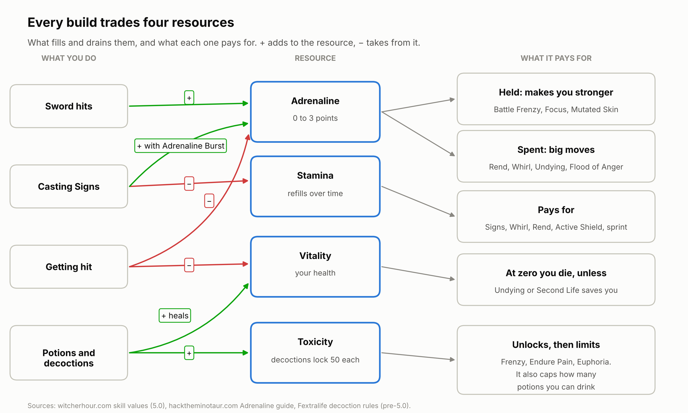

# 1. The resources every build trades

Every build in The Witcher 3 is a way of turning four resources into damage and survival: **Adrenaline, Stamina, Vitality and Toxicity**. The six witcher schools are, at heart, six different answers to which of those four you lean on. Once you can see the resources clearly, every skill, potion and armor piece in this book makes sense as a way to fill one, protect one or spend one.

## Adrenaline

Adrenaline is a bar of **up to three points** that you build by fighting and lose by getting hurt ([Hack the Minotaur](https://hacktheminotaur.com/the-witcher-3/the-witcher-3-adrenaline-points-explained/)).

- **How you gain it:** landing sword hits, landing crossbow bolts (with Cold Blood), and casting damaging Signs (only once you own the General skill Adrenaline Burst). Razor Focus hands you a free point at the start of every fight.
- **How you lose it:** taking damage, stopping your attacks, or leaving combat. Resolve cuts the loss from hits by 33/67/100% at ranks 1/2/3.

The interesting part is that patch 5.0 splits Adrenaline skills into two camps, and they pull against each other:

| Camp | What it does with Adrenaline | Examples (rank 1/2/3 where published) |
| --- | --- | --- |
| **Hold it** | Rewards you for sitting on full points | Battle Frenzy: +3/6/9% crit chance per point held. Focus: +10/20/30% Sign intensity per point held. Mutated Skin (mutation): −15% damage taken per point. |
| **Spend it** | Burns points for a big effect | Rend: +10/20/30% damage per point spent. Whirl: drains Stamina, then Adrenaline. Undying: spends points to heal you at 0 Vitality. Flood of Anger: spends 3 points for a fully upgraded, much stronger Sign. |

A build should pick one camp. A Feline crit build that also spams Whirl is paying for Battle Frenzy and then throwing its fuel away. Rank values here come from the community skill database at [witcherhour.com](https://witcherhour.com/skills/), the most complete 5.0 source so far.

## Stamina

Stamina is the bar under your health. It refills on its own and pays for:

- **every Sign cast**,
- **Whirl** while you keep spinning, and **Rend**, whose damage grows with the Stamina it eats,
- **Active Shield** (Quen's alternate mode) while you hold it up,
- sprinting.

What makes it refill faster: lighter armor (heavier armor slows regeneration), every point you spend in the Signs tree (+0.5% combat Stamina regeneration each), the Tawny Owl potion, Griffin School Techniques at rank 3, and Sun and Stars at night. Sign builds live and die by this bar, which is why the Griffin set's 6-piece bonus is mostly about Stamina ([Fextralife: Chest armor](https://thewitcher3.wiki.fextralife.com/Chest+Armor); [witcherhour.com](https://witcherhour.com/skills/)).

## Vitality

Vitality is your health. Armor and resistances decide how much of an enemy's hit reaches it. A widely used rule of thumb is that damage taken equals the attack minus your armor value, reduced again by your resistance percentage ([Witcher wiki: Armor](https://witcher-games.fandom.com/wiki/Armor_(statistic))). Resistances come in three physical types (slashing, piercing, bludgeoning), plus elemental and monster resistance, and separate resistances to bleeding, poison and burning.

When Vitality hits zero you die, unless something saves you: **Undying** (Combat tree) spends Adrenaline to bring you back, and the **Second Life** mutation gives a full heal on a long cooldown. Healing comes from potions (Swallow, White Raffard's), food, Refreshment (each potion dose heals 10%), and Active Shield, which turns absorbed damage into health.

## Toxicity

Toxicity is the cost of alchemy. Every potion adds some, and it drains away over time. **Decoctions are different: each one locks 50 Toxicity for its full 30-minute duration** (Basilisk locks 40) ([Fextralife: Decoctions](https://thewitcher3.wiki.fextralife.com/Decoctions)). Your maximum was 100 in the next-gen version; no source has confirmed the 5.0 value yet.

Two things make Toxicity a resource rather than just a limit:

1. **Skills and mutations that reward it.** Frenzy only works with Toxicity above 1, Endure Pain adds maximum Vitality above the safe threshold, High Tolerance turns Toxicity into crit damage, and the Euphoria mutation turns every point into sword damage and Sign intensity.
2. **Skills that raise the ceiling.** Acquired Tolerance adds +1/2/3 maximum Toxicity per alchemy recipe you know, and Metabolic Control adds +10/20/30. Chapter 4 shows how many decoctions each setup can afford.

What happens above the safe threshold is one of the places sources disagree. Next-gen guides put the threshold at half your maximum and describe a slow Vitality drain above it ([Console Pulse](https://consolepulse.com/multiplatform/the-witcher/guides/witcher-3-toxicity-overdose-delayed-recovery-guide)), while others say decoction Toxicity doesn't count toward it at all. White Honey clears all Toxicity, along with every active potion effect.

## Fast and strong attacks, and crits

Fast attacks are quick and safe; strong attacks are slow and hit harder. Patch 5.0 rebalanced the two against each other and built skills that make you mix them ([witcherhour.com](https://witcherhour.com/skills/)):

- **Muscle Memory:** after a dodge or roll, your next 1/2/3 fast attacks deal +30%.
- **Strength Training:** fast attacks boost your next strong attack by +15/30/45%.
- **Crushing Blow:** a 20/40/60% chance that your next two strong attacks deal +50%.
- **Sunder Armor:** strong attacks strip 10% of the target's damage resistance per stack, up to 1/2/3 stacks.

No source publishes base crit chance or crit damage. What is known is where crits come from: Battle Frenzy and the Katakan decoction for crit chance; Cat School Techniques, Hunter Instinct and High Tolerance for crit damage; and weapons with crit stats, which include most of the best swords in the game (chapter 17). **Armor piercing** is a weapon stat that ignores part of the target's armor; Rend and Superior Grapeshot ignore armor entirely.

## Signs and Sign intensity

Sign intensity is the Sign version of attack power. The table shows what it raises for each Sign and how 5.0 unlocks the alternate mode, which you cast by holding the Sign button ([Hack the Minotaur: Signs](https://hacktheminotaur.com/the-witcher-3/the-witcher-3-signs-and-upgrades-guide/); [witcherhour.com](https://witcherhour.com/skills/)).

| Sign | Intensity raises | First skill → alternate mode in 5.0 |
| --- | --- | --- |
| **Aard** | Knockdown and stagger chance, blast force | Far-Reaching Aard → **Aard Sweep** (a 360° blast) |
| **Igni** | Fire damage and burn chance | Melt Armor → **Firestream** (a continuous jet of fire) |
| **Yrden** | Slow strength, trap damage | Sustained Glyphs → **Magic Trap** (damages and slows everything in a 14-yard radius) |
| **Quen** | How much damage the shield absorbs | Exploding Shield → **Active Shield** (absorbed damage heals you) |
| **Axii** | Success chance and duration | Delusion → **Puppetmaster** (the target fights for you) |

Sign intensity stacks from armor (Griffin and Wolf School Techniques), potions (Petri's Philter), runestones (Veles) and a family of new 5.0 skills: Focus, Catalyst, Chain Reaction and Flood of Anger. Chapter 9 adds them all up for a Griffin.

## What this means for picking a school

| School | Leans on | What it guards |
| --- | --- | --- |
| Feline | Held Adrenaline, crits | Never getting hit, so the bar stays full |
| Griffin | Stamina, Sign intensity | Stamina regeneration and Yrden positioning |
| Ursine | Vitality, held Adrenaline | Damage reduction and second chances |
| Wolven | A little of everything | Balance between sword and Signs |
| Manticore | Toxicity | Room for decoctions and potions |
| Viper | Toxicity, poison chance | Oils on the blade and hit count |

Part II builds each of those schools in full.

## Sources

- [witcherhour.com: Witcher 3 skills (5.0 values)](https://witcherhour.com/skills/)
- [Hack the Minotaur: Adrenaline Points explained](https://hacktheminotaur.com/the-witcher-3/the-witcher-3-adrenaline-points-explained/)
- [Hack the Minotaur: Signs and upgrades](https://hacktheminotaur.com/the-witcher-3/the-witcher-3-signs-and-upgrades-guide/)
- [Fextralife: Decoctions](https://thewitcher3.wiki.fextralife.com/Decoctions)
- [Fextralife: Chest armor](https://thewitcher3.wiki.fextralife.com/Chest+Armor)
- [Witcher wiki: Armor (statistic)](https://witcher-games.fandom.com/wiki/Armor_(statistic))
- [Console Pulse: Toxicity, overdose and Delayed Recovery](https://consolepulse.com/multiplatform/the-witcher/guides/witcher-3-toxicity-overdose-delayed-recovery-guide)

<!-- nav -->

---

[Contents](../README.md) · [2. The 5.0 skill system →](02-the-skill-system.md)
