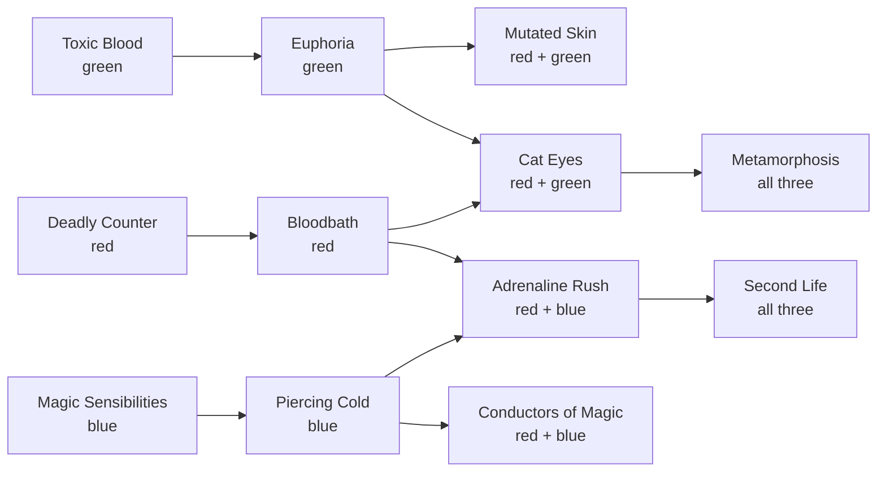

# 5. Mutations (Blood and Wine)

Mutations are the last layer of a build. They arrive in Toussaint, near the end of most playthroughs, and they do two things: one active mutation adds a strong effect of its own, and researching mutations opens up to **four extra skill slots**. For several schools the mutation is what finally makes the build complete: Euphoria for Manticore, Mutated Skin for Ursine, Conductors of Magic for Wolven.

No 5.0 or 5.01 patch note mentions mutations. The costs and effects below are the same in 5.0-era and older sources ([KeenGamer: All mutations](https://www.keengamer.com/articles/guides/the-witcher-3-remastered-all-mutations-how-to-unlock-them/)).

## Unlocking the system

The secondary quest **Turn and Face the Strange** unlocks the Mutations panel. A messenger boy brings Geralt a letter in Beauclair, from Yennefer or Triss depending on your romance. It sends you after the research of the late Professor Moreau: his grave at Orlémurs Cemetery, the flooded ruins in the Valley of the Nine, a gargoyle fight and a portal puzzle, his lab, an ingredient from a Pale Widow cave, and finally his machine ([Fextralife: quest](https://thewitcher3.wiki.fextralife.com/Turn+and+Face+the+Strange); [KeenGamer](https://www.keengamer.com/articles/guides/the-witcher-3-remastered-all-mutations-how-to-unlock-them/)).

Sources disagree on when the letter arrives. KeenGamer and Console Pulse say after the main quest *Blood Run*, Fextralife lists *The Beast of Toussaint* as the prerequisite (suggested level 35), and Vulkk ties it to *La Cage au Fou*. All three are early Blood and Wine quests, so in practice the letter shows up within the first few hours in Toussaint.

**Tip the boy.** Giving the messenger a tip counts toward the Generosity virtue for Aerondight (chapter 17).

## How research works

Open the Mutations panel from the character screen (Triangle on PlayStation, C on PC). **Researching** a mutation is a one-time purchase that costs **Ability Points**, the same points you spend on skills, plus **greater mutagens** of the listed colors. **Activating** a researched mutation is free, and only one can be active at a time ([Console Pulse: Unlock order](https://consolepulse.com/multiplatform/the-witcher/guides/the-witcher-3-mutation-system-unlock-order-builds)).

| Ring | Example | Cost |
| --- | --- | --- |
| Inner, one color | Deadly Counter, Magic Sensibilities, Toxic Blood | 2 points + 2 greater mutagens |
| Second ring, one color | Bloodbath, Piercing Cold, Euphoria | 3 points + 3 greater mutagens |
| Two colors | Mutated Skin, Cat Eyes, Adrenaline Rush, Conductors of Magic | 5 points + 3 and 2 greater mutagens |
| Three colors | Metamorphosis, Second Life | 7 points + 3, 2 and 2 greater mutagens |

Researching the **whole tree costs 49 Ability Points and 49 greater mutagens** (18 red, 15 blue, 16 green). Red runs out first. Research order doesn't change the prices ([KeenGamer](https://www.keengamer.com/articles/guides/the-witcher-3-remastered-all-mutations-how-to-unlock-them/); [Console Pulse](https://consolepulse.com/multiplatform/the-witcher/guides/the-witcher-3-mutation-system-unlock-order-builds)).

**Getting greater mutagens.** Only the greater grade counts. Three lesser mutagens combine into one normal mutagen, and three normal into one greater, so each greater mutagen is worth nine lesser ones ([Fextralife: Mutagens](https://thewitcher3.wiki.fextralife.com/Mutagens)). Once you renovate the lab at Corvo Bianco, it breaks monster mutagens down into colored ones. Start saving mutagens long before Toussaint.

**Respec.** A **Potion of Restoration** refunds the Ability Points spent on mutations but not the mutagens. The perfumer at the Chuchote cave sells it after *The Vintners' Contract: Chuchote*, for about 1,000 crowns. A Potion of Clearance only refunds skills ([Console Pulse](https://consolepulse.com/multiplatform/the-witcher/guides/the-witcher-3-mutation-system-unlock-order-builds); [FinalBoss](https://finalboss.io/the-witcher-3-wild-hunt-how-to-rebuild-the-5-0-skill-tree)).

## The four extra skill slots

The large node in the middle of the panel, **Strengthened Synapses**, is always active and free. It levels up as you research other mutations, and each level opens one extra skill slot.

- **When they open.** After **2, 4, 8 and 12** researched mutations, as most sources say and the game files confirm. At the cheapest research order, that's 4, 9, 25 and 49 Ability Points ([KeenGamer](https://www.keengamer.com/articles/guides/the-witcher-3-remastered-all-mutations-how-to-unlock-them/); [Push Square](https://www.pushsquare.com/guides/the-witcher-3-blood-and-wine-mutation-character-builds)). Gamer Guides' 2, 4, 6 and 8 doesn't match the files ([Gamer Guides](https://www.gamerguides.com/the-witcher-3-wild-hunt/guide/blood-and-wine-side-quests/turn-and-face-the-strange/how-to-unlock-the-mutations-tree-in-blood-and-wine)).
- **Color rule.** The extra slots only take skills that match the **active** mutation's color: red takes Combat skills, blue takes Signs, green takes Alchemy. Two- and three-color mutations accept any of their colors.
- **Limits.** General skills never fit. The extra slots get no mutagen bonus. Switching to a mutation of another color can eject skills that no longer match.

A 5.0 build with all four extra slots runs **16 equipped skills**, 12 regular plus 4 from mutations ([Console Pulse: Griffin Igni build](https://consolepulse.com/multiplatform/the-witcher/guides/witcher-3-remastered-griffin-igni-pure-sign-build)). Getting there means researching all 12 mutations (49 points), so unless you play long into the endgame or New Game+, plan on one or two.

## All twelve mutations

| Mutation | Color | Cost | Needs | Effect |
| --- | --- | --- | --- | --- |
| **Deadly Counter** | Red | 2 + 2 red | — | +25% sword damage against monsters and against humans who can't be countered; countering an enemy below 25% Vitality can trigger a finisher |
| **Bloodbath** | Red | 3 + 3 red | Deadly Counter | +5% attack power per melee hit until combat ends, lost when you're hit; fatal blows dismember or finish |
| **Magic Sensibilities** | Blue | 2 + 2 blue | — | Signs can crit: 20% plus 10% per point of the Sign's intensity multiplier (30% unboosted), and a crit adds that multiplier again; enemies killed by a Sign crit explode |
| **Piercing Cold** | Blue | 3 + 3 blue | Magic Sensibilities | Aard can freeze; a frozen enemy that's knocked down dies instantly |
| **Toxic Blood** | Green | 2 + 2 green | — | Enemies that hit you in melee take damage based on your Toxicity |
| **Euphoria** | Green | 3 + 3 green | Toxic Blood | In combat, +0.75 percentage points of attack power and Sign intensity per point of current Toxicity, decoctions included, with no cap |
| **Mutated Skin** | Red + green | 5 + 3 green, 2 red | Euphoria | −15% damage taken per whole Adrenaline point held, up to −45%; spending Adrenaline lowers it; inactive while Quen is up and against damage over time |
| **Cat Eyes** | Red + green | 5 + 3 green, 2 red | Bloodbath and Euphoria | Big crossbow damage boost, +50% crossbow crit chance; bolts pierce and knock down |
| **Metamorphosis** | All three | 7 + 3 green, 2 red, 2 blue | Cat Eyes | Applying a critical effect to an enemy, ordinary poison included, starts a random crafted decoction for 120 s with no Toxicity cost, up to five at once |
| **Adrenaline Rush** | Red + blue | 5 + 3 blue, 2 red | Piercing Cold and Bloodbath | A big attack power and Sign intensity boost at the start of a fight against several enemies, then a dip |
| **Conductors of Magic** | Red + blue | 5 + 3 blue, 2 red | Piercing Cold | With a magic, unique or witcher sword drawn, Signs add half the sword's base damage stat before Sign intensity applies |
| **Second Life** | All three | 7 + 3 red, 2 blue, 2 green | Adrenaline Rush | At 0 Vitality: brief invulnerability and a full heal, then a 120-second cooldown |

Costs, prerequisites, Euphoria, Magic Sensibilities, Conductors, Metamorphosis and Second Life's cooldown match the game files; chapter 19 has the formulas. Costs are Ability Points plus greater mutagens. Other effects from [KeenGamer](https://www.keengamer.com/articles/guides/the-witcher-3-remastered-all-mutations-how-to-unlock-them/); costs match [Gamer Guides](https://www.gamerguides.com/the-witcher-3-wild-hunt/guide/blood-and-wine-side-quests/turn-and-face-the-strange/how-to-unlock-the-mutations-tree-in-blood-and-wine) and [Console Pulse](https://consolepulse.com/multiplatform/the-witcher/guides/the-witcher-3-mutation-system-unlock-order-builds).

**Numbers that sources disagree on** (check the tooltip):

- **Toxic Blood:** 1.5% or 3% of the damage dealt per Toxicity point, with caps of 150% up to 387%.
- **Euphoria:** guides give caps of 75%, 112.5% or 193.5%. The game files have no cap at all: the tooltip's maximum is 0.75% of your maximum Toxicity, which is why it seemed to rise with it. FinalBoss and VGTimes say 5.0 weakened Euphoria, though no patch note says so.
- **Piercing Cold:** a flat 25% freeze chance, 0–25% scaling with Adrenaline, or 30%.
- **Adrenaline Rush:** one source says the second phase is a penalty, another a smaller bonus. The game files define a −10% attack power and Sign intensity debuff, which supports the penalty.
- **Second Life:** guides give a 180-second or a 120-second cooldown; the game files say 120.
- **Metamorphosis:** guides say up to 3 or up to 5 decoctions at once; the game files cap it at 5.

## Which mutation for which school

Each school chapter explains its pick; this table collects them. Cost is the cheapest research path to that mutation, in Ability Points.

| School | Mutation | Research path and cost | Extra slots take |
| --- | --- | --- | --- |
| **Feline** | Bloodbath | Deadly Counter → Bloodbath: 5 points, 5 red | Combat |
| **Griffin** | Magic Sensibilities, later Conductors of Magic | Magic Sensibilities: 2 points; on to Conductors: 10 points | Signs (Conductors: Combat or Signs) |
| **Ursine** | Mutated Skin, later Second Life | Toxic Blood → Euphoria → Mutated Skin: 10 points (5 if it has no prerequisite) | Combat or Alchemy |
| **Wolven** | Conductors of Magic | Magic Sensibilities → Piercing Cold → Conductors: 10 points | Combat or Signs |
| **Manticore** | Euphoria | Toxic Blood → Euphoria: 5 points, 5 green | Alchemy |
| **Viper** | Euphoria, later Metamorphosis | Euphoria: 5 points; Metamorphosis: 22 points | Alchemy (Metamorphosis: any) |

Two practical rules follow from the slot milestones:

- **One mutation alone opens no slot.** Magic Sensibilities by itself is one researched mutation, and the first extra slot needs two. The second can be any color, because the slots follow the *active* mutation's color: Deadly Counter, Magic Sensibilities and Toxic Blood cost 2 points each.
- **Every Ability Point here is one not spent on a skill rank.** Ten points on Mutated Skin is ten rank-ups you didn't buy. It's usually worth it for the mutation you'll keep active, and rarely worth it just to fill the tree.

## Sources

- [KeenGamer: All mutations and how to unlock them (Remastered)](https://www.keengamer.com/articles/guides/the-witcher-3-remastered-all-mutations-how-to-unlock-them/)
- [Console Pulse: Mutation unlock order and builds](https://consolepulse.com/multiplatform/the-witcher/guides/the-witcher-3-mutation-system-unlock-order-builds)
- [Console Pulse: Mutations ranked](https://consolepulse.com/multiplatform/the-witcher/guides/the-witcher-3-mutations-ranked)
- [Gamer Guides: How to unlock the mutations tree](https://www.gamerguides.com/the-witcher-3-wild-hunt/guide/blood-and-wine-side-quests/turn-and-face-the-strange/how-to-unlock-the-mutations-tree-in-blood-and-wine)
- [Push Square: Mutation character builds](https://www.pushsquare.com/guides/the-witcher-3-blood-and-wine-mutation-character-builds)
- [Fextralife: Mutations](https://thewitcher3.wiki.fextralife.com/Mutations) and [Turn and Face the Strange](https://thewitcher3.wiki.fextralife.com/Turn+and+Face+the+Strange)
- [Witcher wiki (games): Mutations](https://witcher-games.fandom.com/wiki/Mutations) and [Strengthened Synapses](https://witcher-games.fandom.com/wiki/Strengthened_Synapses)
- [FinalBoss: How to rebuild the 5.0 skill tree](https://finalboss.io/the-witcher-3-wild-hunt-how-to-rebuild-the-5-0-skill-tree)

<!-- nav -->

---

[← 4. Alchemy basics](04-alchemy.md) · [Contents](../README.md) · [6. Enchanting (Hearts of Stone) →](06-enchanting.md)
