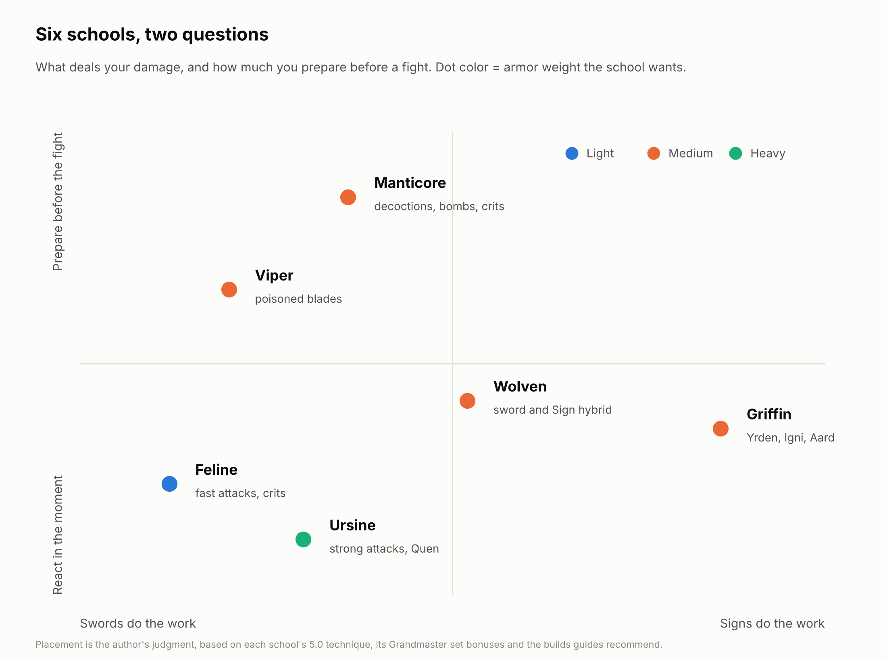

# 7. Choosing a school

In the books, a witcher's school was where he trained: a keep, a teacher, a set of habits. In the game, a school is three things that patch 5.0 has pulled closer together:

1. **A School Technique** in the General tree, which rewards one armor weight (chapter 3).
2. **A Grandmaster set**, whose 3- and 6-piece bonuses define the endgame.
3. **A way of fighting** that the rest of the skill tree, the right mutation and the right consumables push you toward.

The first is available from your first skill point, the third grows over the whole game, and the second only arrives at level 40. That's why this book treats a school as a playstyle you can start in White Orchard, not a set you wait for.

## The six at a glance

| | Feline | Griffin | Ursine | Wolven | Manticore | Viper |
| --- | --- | --- | --- | --- | --- | --- |
| **Armor** | Light | Medium | Heavy | Medium | Medium | Medium |
| **Technique, 4 pieces at rank 3** | +24% fast attacks (the published +96% crit damage adds nothing) | +24% Sign intensity, +2.4 Stamina/s | +24% Vitality, +24% strong attacks | +24% weapon damage and Sign intensity | +24% sword and bomb damage | +24% Vitality and poison damage |
| **Leans on** | Held Adrenaline, crits | Stamina, Yrden | Vitality, Quen | A bit of everything | Toxicity, decoctions | Poison, oils |
| **First set tier** | Level 17 | Level 11 | Level 20 | Level 14 (Kaer Morhen) | Level 40 only | Swords level 1, armor 39 |
| **Grandmaster bonus, short** | Strong attacks power up fast attacks; rear attacks stun | Free follow-up Signs; huge bonuses inside Yrden | Free Quen recasts; Quen damage +200% | Bleeding stacks into sword damage | Bombs crit; +1 charge on every alchemy item | None |
| **Mutation** | Bloodbath | Magic Sensibilities, then Conductors of Magic | Mutated Skin | Conductors of Magic | Euphoria | Euphoria |
| **Effort** | High skill, low prep | Medium | Low | Medium | High prep | High prep, missable gear |
| **Chapter** | [8](08-feline.md) | [9](09-griffin.md) | [10](10-ursine.md) | [11](11-wolven.md) | [12](12-manticore.md) | [13](13-viper.md) |

Technique values: [witcherhour.com](https://witcherhour.com/skills/). Set levels and bonuses: chapter 3. The Wolven set's Basic tier is level 14, but its armor diagrams sit in Kaer Morhen, which only opens after the main quest *Ugly Baby*.

## Five questions that decide it

**What do you enjoy doing with your hands?** Dodging and punishing with quick strings is Feline. Trading heavy blows behind a shield is Ursine. Placing traps and casting is Griffin. Mixing all three is Wolven.

**How much do you like preparing?** Manticore and Viper fights are won before they start: the right oil, the right decoctions, Toxicity managed. Feline and Ursine fights are won in the moment. Griffin and Wolven sit in between.

**What difficulty are you on?** On Death March the margin for error shrinks. KeenGamer and FinalBoss call Ursine the safest Death March build, while other guides pick Signs, a Wolf hybrid or Manticore (chapter 14). FinalBoss calls Feline viable but unforgiving there ([KeenGamer](https://www.keengamer.com/articles/guides/the-witcher-3-remastered-best-builds-for-every-playstyle/); [FinalBoss](https://finalboss.io/the-witcher-3-wild-hunt-choose-the-best-remastered-build-by-playstyle)).

**Do you own the expansions?** Manticore needs Blood and Wine for its set and for Euphoria. Viper needs Hearts of Stone for its armor. Every school's Grandmaster tier is in Blood and Wine.

**Do you care about looking the part?** Since 5.0 you don't have to: Reforge lets you wear one set's stats under another set's look (chapter 3).

## You can mix more than you think

- **Techniques follow weight, not sets.** Wolf, Griffin, Manticore and Viper Techniques all count any medium armor. A Griffin-armor Wolven build is completely normal before level 40.
- **Glyphwords change weight.** Levity, Balance and Heft make all your armor count as light, medium or heavy (chapter 6). Two 5.0 guides run Manticore armor with Levity and Cat School Techniques.
- **Respec is cheap.** A Potion of Clearance costs about 1,000 crowns, and no skill in 5.0 is more than seven points from a starting skill. Switching school at level 30 or at the start of Blood and Wine costs very little (chapter 20).

## How each school chapter is laid out

Every chapter in Part II runs in the same order:

1. **Lore:** who the school were, and where you meet them in The Witcher 3.
2. **How it plays:** the resource loop, in a paragraph.
3. **Skills by phase:** what to buy, in order, with every prerequisite listed. The phases assume about one point per level; each Place of Power gives one more the first time you use it, the Magic Acorn two and Blood and Wine's Golden Egg one, so you'll usually be a little ahead.
4. **Slots, mutagens and mutation:** the final layout of the 12 slots plus mutation slots.
5. **Consumables and the fight loop.**
6. **Gear path:** armor and swords from White Orchard to Toussaint, with links to diagram location guides.
7. **The maths**, where sources publish numbers.
8. **Verdict:** strengths, weaknesses, and who it suits.

Chapter 14 then ranks all six.

## Sources

- [witcherhour.com: Witcher 3 skills](https://witcherhour.com/skills/)
- [KeenGamer: Best builds for every playstyle](https://www.keengamer.com/articles/guides/the-witcher-3-remastered-best-builds-for-every-playstyle/)
- [FinalBoss: Choose the best Remastered build by playstyle](https://finalboss.io/the-witcher-3-wild-hunt-choose-the-best-remastered-build-by-playstyle)
- [Hack the Minotaur: Best builds](https://hacktheminotaur.com/the-witcher-3/witcher-3-best-builds/)
- [Console Pulse: Grandmaster gear sets compared](https://consolepulse.com/multiplatform/the-witcher/guides/witcher-3-grandmaster-gear-sets-bonuses-compared)

<!-- nav -->

---

[← 6. Enchanting (Hearts of Stone)](06-enchanting.md) · [Contents](../README.md) · [8. Feline: the School of the Cat →](08-feline.md)
