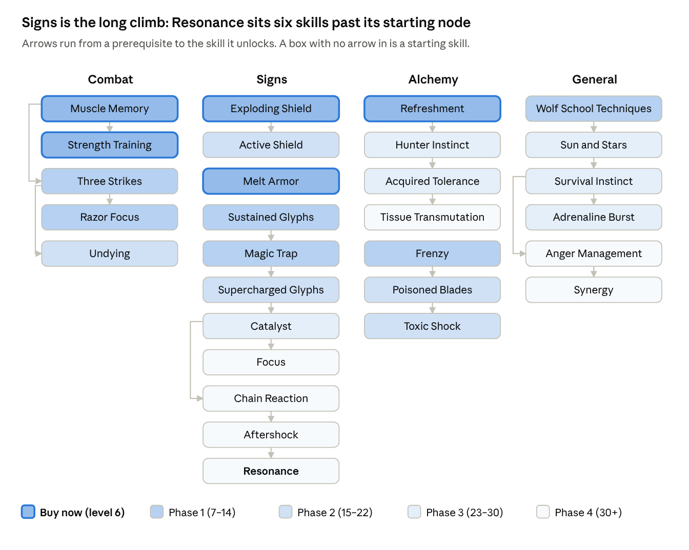

# 11. Wolven: the School of the Wolf

> Geralt's own school: sword first, Signs to set up the hits, a little alchemy to keep going.

## Lore

**Kaer Morhen** stands in the Blue Mountains of Kaedwen, by the Gwenllech river, reachable only by a trail the witchers nicknamed "the Killer". The Trials took place in a laboratory beneath the keep, and roughly three boys in ten survived the Trial of the Grasses ([Witcher wiki: Kaer Morhen](https://witcher.fandom.com/wiki/Kaer_Morhen); [Trial of the Grasses](https://witcher.fandom.com/wiki/Trial_of_the_Grasses)). For a time the kings of Kaedwen funded both the Wolf and the Cat schools, with students moving between them, until King Radowit II's soldiers attacked the witchers at a tournament. A mob led by mages and priests stormed the keep and killed every witcher inside. The school never recovered: the last boys were trained in the 1230s, and the knowledge of the Trials was lost ([Witcher wiki: School of the Wolf](https://witcher.fandom.com/wiki/School_of_the_Wolf)).

What survives is a handful of witchers who still winter at the keep: **Vesemir**, the oldest, a fencing master who can no longer make new witchers; **Lambert**, one of the last trained, known for his sharp tongue; **Eskel**, calm and reliable; and **Geralt**. One secondary wiki describes the Wolves as the most rounded school, with balanced training in swords, Signs, herbalism, bombs and monster lore ([The Games Wiki](https://thegameswiki.com/the-witcher-iv/wiki/witcher-schools)).

**In The Witcher 3,** the Wolven gear hunt follows the journals of the mage **Hieronymus**, his assistant **Chird**, and **Varin**, who trained young witchers; together they explain how upgraded witcher gear was first made ([Witcher wiki: Scavenger Hunt: Wolf School Gear](https://witcher.fandom.com/wiki/Scavenger_Hunt:_Wolf_School_Gear)). The **Forgotten Wolven** set, added in the 2022 next-gen update with a look based on the Netflix series, comes from the spirit of **Reinald** and from Osmund's notes in Kaer Morhen's main hall ([Fextralife: Forgotten Wolf School Gear](https://thewitcher3.wiki.fextralife.com/Scavenger+Hunt:+Forgotten+Wolf+School+Gear+Diagrams)).

## How it plays

Wolf School Techniques is the only Technique that raises **both** weapon damage and Sign intensity, so a Wolven build uses all three trees at once:

| Role | Tree | Core skills |
| --- | --- | --- |
| Damage | Combat | Muscle Memory, Strength Training |
| Setup and defense | Signs | Quen (Exploding and Active Shield), Igni (Melt Armor), Yrden (Magic Trap) |
| Sustain and poison | Alchemy | Refreshment, Poisoned Blades, Toxic Shock |
| Glue | General | Wolf School Techniques, then Adrenaline Burst and Synergy |

The rhythm is **Sign, dodge, three fast attacks, a strong finisher**. Quen keeps you safe, Igni strips armor, Yrden controls groups and wraiths, the fast attacks charge the strong one, and an oiled blade sometimes poisons the target so the finisher bursts. Late in the game Catalyst, Focus and Resonance tie the Signs back into the sword: a Sign before every string makes the next three hits deal extra damage.

It's the build this book was first written around, and the one VGTimes calls the most classic witcher build and Game Overdrive recommends as the default for a first playthrough ([VGTimes](https://vgtimes.com/guides/169608-best-builds-in-the-witcher-3-remastered-skills-and-progression.html); [Game Overdrive](https://gameoverdrive.com.br/melhores-builds-the-witcher-3-remastered/)).

## Skills by phase

Buy each table from the top down; every prerequisite is either already owned or listed higher up. The plan assumes about one point per level; Places of Power just move you through it faster.

### Opening: the first 6 points

| Skill | Tree | Rank | Requires | Why |
| --- | --- | --- | --- | --- |
| Muscle Memory | Combat | 1 | start | After a dodge or roll, your next fast attack deals +30% |
| Strength Training | Combat | 1 | Muscle Memory | Fast attacks raise your next strong attack's damage by 15% |
| Muscle Memory | Combat | 2 | — | The bonus covers two fast attacks |
| Exploding Shield | Signs | 1 | start | Quen. When it breaks it pushes enemies back and, since 5.01, reflects damage |
| Melt Armor | Signs | 1 | start | Igni strips armor and gains +10% burn chance |
| Refreshment | Alchemy | 1 | start | Each potion dose heals 10% Vitality |

### Phase 1: to 13 points (about levels 7–14)

| Skill | Tree | Rank | Requires | Why |
| --- | --- | --- | --- | --- |
| Three Strikes | Combat | 1 | Muscle Memory | Prerequisite for Razor Focus and Undying; its fourth same-style hit bonus does not activate in the three-fast/strong loop |
| Razor Focus | Combat | 1 | Three Strikes | Start every fight with 1 Adrenaline; +10% Adrenaline from hits |
| Sustained Glyphs | Signs | 1 | start | Yrden lasts longer, with an extra trap and more Magic Trap charges |
| Magic Trap | Signs | 1 | Sustained Glyphs | Yrden's alternate mode damages and slows everything within 14 yards; key against wraiths |
| Frenzy | Alchemy | 1 | start | Time slows before enemy counters once you've drunk a potion |
| Wolf School Techniques | General | 1 | start | +2% weapon damage and Sign intensity per medium piece. Take it once you're in medium armor |
| Exploding Shield | Signs | 2 | — | Stronger push |

### Phase 2: to 20 points (about levels 15–22)

| Skill | Tree | Rank | Requires | Why |
| --- | --- | --- | --- | --- |
| Poisoned Blades | Alchemy | 1 | Frenzy | Oiled blades have a 5% chance to poison |
| Toxic Shock | Alchemy | 1 | Poisoned Blades | A strong attack on a poisoned target uses up the poison for a burst worth 25% of the hit |
| Undying | Combat | 1 | Three Strikes | At 0 Vitality, spends Adrenaline to bring you back |
| Active Shield | Signs | 1 | Exploding Shield | Hold Quen to keep a shield up that heals you |
| Supercharged Glyphs | Signs | 1 | Magic Trap | Enemies in Yrden lose Vitality every second |
| Muscle Memory | Combat | 3 | — | Three boosted fast attacks after every dodge |
| Strength Training | Combat | 2 | — | +30% on the finisher |

### Phase 3: to 28 points (about levels 23–30)

| Skill | Tree | Rank | Requires | Why |
| --- | --- | --- | --- | --- |
| Catalyst | Signs | 1 | Supercharged Glyphs | Igni and Aard +30% intensity against enemies inside Yrden |
| Hunter Instinct | Alchemy | 1 | Refreshment | +20% crit damage at full Adrenaline against the oiled monster type |
| Acquired Tolerance | Alchemy | 1 | Hunter Instinct | +1 max Toxicity per known recipe |
| Sun and Stars | General | 1 | Wolf School Techniques | Regeneration by day and night; mostly a stepping stone |
| Survival Instinct | General | 1 | Sun and Stars | +8% max Vitality |
| Adrenaline Burst | General | 1 | Survival Instinct | Signs generate Adrenaline |
| Wolf School Techniques | General | 2 | — | +4% per medium piece |
| Wolf School Techniques | General | 3 | — | +6% per medium piece; replaces the extra Three Strikes rank for this rotation |

### Phase 4: level 30+ and Blood and Wine

- **Focus** (Signs, from Catalyst): +10/20/30% Sign intensity per Adrenaline point held.
- **Tissue Transmutation** (Alchemy, from Acquired Tolerance): +300/600/900 max Vitality while a decoction is active.
- **Anger Management → Synergy** (General, from Survival Instinct): cast Signs with Adrenaline when out of Stamina, then stronger mutagens.
- **Chain Reaction → Aftershock → Resonance** (Signs, from Catalyst): after you cast a Sign, your next three melee hits deal bonus damage based on your Sign intensity (10/20/30%). This is the hybrid's capstone.
- **Rank-ups:** Toxic Shock 3 (the burst grows to 75% of the hit), Poisoned Blades 3 (15% per hit), Strength Training 3, Catalyst 3, Resonance 3, Active Shield 2, Melt Armor 2.
- **Mutation:** Conductors of Magic (below).

Cumulative points after each phase:

| Phase | Combat | Signs | Alchemy | General | Total |
| --- | --- | --- | --- | --- | --- |
| Opening | 3 | 2 | 1 | 0 | 6 |
| Phase 1 | 5 | 5 | 2 | 1 | 13 |
| Phase 2 | 8 | 7 | 4 | 1 | 20 |
| Phase 3 | 8 | 8 | 6 | 6 | 28 |

Early points go where they pay off at once: sword damage and Quen. Alchemy and General points mostly unlock later skills, and every point may also earn its tree's branch passive (chapter 2; sources disagree on whether unslotted skills count).

## Slots, mutagens and mutation

**While slots are scarce,** equip in this order and fill new slots from the top of what's left:

1. Muscle Memory
2. Strength Training
3. Exploding Shield, then Active Shield once you have it
4. Melt Armor
5. Refreshment
6. Wolf School Techniques (once you're in medium armor)
7. Magic Trap
8. Razor Focus
9. Poisoned Blades
10. Toxic Shock (equip it together with Poisoned Blades; it has nothing to burst without poison)
11. Catalyst
12. Undying

As Focus, Resonance and Synergy arrive, they take the places of Refreshment, Undying and Melt Armor; Melt Armor and Undying can return in mutation slots. Keep Three Strikes unslotted for the three-fast/strong loop. Use it as an optional alternative only when you regularly make four consecutive same-style hits.

**Delusion:** if you use Axii in conversations, Delusion has to stay slotted for its dialogue options. Put it in the group with Quen early on; at the end it takes Synergy's slot.

**The finished layout:**

| Group | Skills | Mutagen |
| --- | --- | --- |
| 1 | Muscle Memory, Strength Training, Razor Focus | Red |
| 2 | Active Shield, Magic Trap, Catalyst | Blue |
| 3 | Focus, Resonance, Synergy | Blue |
| 4 | Poisoned Blades, Toxic Shock, Wolf School Techniques | Green |
| Mutation slots (red or blue) | Melt Armor, Undying, Supercharged Glyphs, Aftershock | — |

**Mutation: Conductors of Magic** (Magic Sensibilities, Piercing Cold, then Conductors: 10 Ability Points). With a magic, unique or witcher sword drawn, your Signs add **50% of that sword's damage**. Before 5.0 it applied fully to Igni, to Quen's explosion and reflection, and to the Yrden trap, but not to Yrden's damage over time ([Fextralife: Mutations](https://thewitcher3.wiki.fextralife.com/Mutations)). It's red and blue, so its extra slots take either half of the build; the first one opens with your second research, Piercing Cold. If you'd rather go all in on alchemy, Euphoria is the alternative (chapter 12).

## Consumables and the fight loop

**Keep crafting:** Swallow (healing), Thunderbolt (attack power), Tawny Owl (Stamina for Signs), and the right oil for every monster type, because both Poisoned Blades and Hunter Instinct only work with an oil on the blade. **Decoction:** **Forktail** fits the hybrid perfectly: chain three different kinds of action (a Sign, a fast attack, a strong attack) and the next attack or Sign gets +50% ([Fextralife: Decoctions](https://thewitcher3.wiki.fextralife.com/Decoctions)). With Acquired Tolerance, add Ekimmara or Ancient Leshen.

**The loop:**

1. **Before the fight:** apply the right oil and drink your potions. Drinking anything switches Frenzy on.
2. **Open:** cast Quen. Against groups or wraiths, lay a Magic Trap; once you have Catalyst, fight inside it.
3. **Soften up:** hit armored targets with Igni so Melt Armor strips their armor.
4. **Punish:** dodge or roll, then land three fast attacks. Muscle Memory rank 3 boosts all three. Three Strikes does not activate before switching to the strong finisher.
5. **Finish:** end the string with a strong attack. It uses the Strength Training stack, and on a poisoned target it also triggers Toxic Shock.
6. **Recover:** recast Quen when it breaks; drink if you're low (Refreshment heals 10% per dose).
7. **Late game:** cast a Sign before each string so Resonance powers up the three hits after it, and **hold your Adrenaline**: Undying and Focus both want points banked.

## Gear path

| Levels | Armor | Swords |
| --- | --- | --- |
| 1–10 | Any medium armor: **Armor of a Thousand Flowers** (level 7) or **White Tiger of the West** (level 11) if your account has them; the **Nilfgaardian** set (level 10) from the Crow's Perch quartermaster | Whatever has the most damage |
| 11–19 | **Griffin** Basic (11) and Enhanced (18). It's medium, so it feeds Wolf School Techniques perfectly | Griffin swords |
| 20–33 | **Forgotten Wolven** Basic (20), or **Wolven** Enhanced (21) and Superior (29) once Kaer Morhen is open | Forgotten Wolven or Wolven swords |
| 34–39 | **Mastercrafted Forgotten Wolven** or **Mastercrafted Wolven** (34; Yoana and Hattori) | Mastercrafted swords of the same set |
| 40+ | **Grandmaster Forgotten Wolven**, all six pieces (Lazare Lafargue) | Both Grandmaster Forgotten Wolven swords |

**Where the two Wolf sets come from.**

- **Wolven:** Basic level 14, but its armor diagrams sit in **Kaer Morhen**, which only opens after the main quest *Ugly Baby*, so in practice it arrives mid-game. The hunt can also start from notes sold in Lindenvale or Kaer Trolde. The later tiers are spread across Velen and Skellige, and the Grandmaster diagrams are in the Termes Palace Ruins in Toussaint ([Console Pulse: Wolf School gear](https://consolepulse.com/multiplatform/the-witcher/guides/witcher-3-wolf-school-gear-guide); [Mobalytics](https://mobalytics.gg/gamebase/guides/witcher-3-how-to-get-wolven-school-gear-set)).
- **Forgotten Wolven:** only Basic (20), Mastercrafted (34) and Grandmaster (40). The Basic diagrams are the reward for *In the Eternal Fire's Shadow*, which starts with an Eternal Fire priest at Devil's Pit in Velen (quest level 15); Reinald hands over all six. The Mastercrafted and Grandmaster diagrams are in Osmund's and Vesemir's notes on the upper bookcase in Kaer Morhen's main hall, reached by a ladder; the Grandmaster tier needs Blood and Wine ([Console Pulse: Forgotten Wolf gear](https://consolepulse.com/multiplatform/the-witcher/guides/the-witcher-3-forgotten-wolf-school-gear-guide); [Fextralife](https://thewitcher3.wiki.fextralife.com/Scavenger+Hunt:+Forgotten+Wolf+School+Gear+Diagrams)).

**Why Forgotten Wolven for this build.** Its pieces are built for sword and Sign play: the chest adds attack power and Adrenaline gain, the gauntlets Aard intensity, the trousers Sign intensity, the boots Yrden intensity, and the swords Sign intensity, Adrenaline, crits and bleeding ([GGRecon](https://www.ggrecon.com/guides/the-witcher-3-forgotten-wolf-armor/)). Its Grandmaster bonuses fit too: **+7% potion duration per set piece** at three pieces, and **extra Aard damage against enemies affected by Yrden** at six, which is the same trap-then-Sign setup Catalyst already rewards. The regular Wolven set's bonuses are about bleeding instead (chapter 3), which suits a fast-attack build better. Some wiki pages show the bleed bonus on Forgotten Wolven pieces as well, so check the tooltip before you craft.

**Swords.** Until the Grandmaster swords, use whatever has the most damage: Conductors of Magic adds half of it to your Signs, and Resonance adds Sign damage to your sword, so a strong sword helps both halves. Don't hold on to a weak sword just because it matches a set before level 40, because sets give no bonus before Grandmaster.

**Enchanting** (chapter 6): **Protection** on the chest gives you a free Quen every time a fight starts. A mix of Chernobog (attack power) and Veles (Sign intensity) runestones on the swords. Skip Replenishment: it spends the Adrenaline that Focus and Undying want you to hold.

## The maths

The previous **+23% / +89%** combo comparison is withdrawn. It assumed a 2:1 strong/fast damage ratio and treated Wolf School Techniques as a separate multiplier on the complete result. The installed damage code does not support that as a general calculation; [chapter 19](19-the-maths.md#1-a-basic-combo-which-skills-actually-activate) explains the limits.

The rotation still fits Muscle Memory, Strength Training and a poison-dependent Toxic Shock finisher. The file audit does change Three Strikes: it checks the fourth matching hit, and switching attack style resets the other counter. Repeating three fast attacks followed by a strong attack never reaches that check. Keep its first point for prerequisites, move the former second point to Wolf School Techniques, and use the active slot for a skill that can activate.

Melt Armor has a verified intensity-dependent armor-reduction formula, but its damage benefit depends on enemy armor. Aftershock has a verified damage coefficient and a radius of 3 game units, with two power-scaling stages. Neither should be counted as a fixed percentage added to every combo. See [chapter 19](19-the-maths.md#11-melt-armor-intensity-dependent-armor-reduction).

## Verdict

**Strengths.** It uses everything the game offers, it's good from the first hour to the last, and it has no hard counter: when Signs don't work, the sword does, and the other way round. It's also the best way to learn the systems before committing to a specialist school.

**Weaknesses.** VGTimes calls it not the best at anything ([VGTimes](https://vgtimes.com/guides/169608-best-builds-in-the-witcher-3-remastered-skills-and-progression.html)), and that matches the numbers in this book: a pure Griffin out-casts it, a Feline out-crits it, an Ursine out-tanks it. It also has the most buttons to press.

**Who it suits:** a first playthrough, players who want to play Geralt the way the books describe him, and anyone who likes every tool to stay useful.

## Sources

- [Witcher wiki: School of the Wolf](https://witcher.fandom.com/wiki/School_of_the_Wolf), [Kaer Morhen](https://witcher.fandom.com/wiki/Kaer_Morhen), [Trial of the Grasses](https://witcher.fandom.com/wiki/Trial_of_the_Grasses), [Scavenger Hunt: Wolf School Gear](https://witcher.fandom.com/wiki/Scavenger_Hunt:_Wolf_School_Gear), [Wolf School Gear](https://witcher.fandom.com/wiki/Wolf_School_Gear)
- [witcherhour.com: Witcher 3 skills](https://witcherhour.com/skills/)
- [WitcherDB: Remastered build planner](https://witcherdb.com/build-planner)
- [KeenGamer: Best builds for every playstyle](https://www.keengamer.com/articles/guides/the-witcher-3-remastered-best-builds-for-every-playstyle/)
- [FinalBoss: How to build around Adrenaline (5.0)](https://finalboss.io/the-witcher-3-wild-hunt-how-to-build-around-adrenaline-remastered-5-0)
- [VGTimes: Best builds in Remastered](https://vgtimes.com/guides/169608-best-builds-in-the-witcher-3-remastered-skills-and-progression.html)
- [Game Overdrive: Melhores builds](https://gameoverdrive.com.br/melhores-builds-the-witcher-3-remastered/)
- [Console Pulse: Wolf School gear](https://consolepulse.com/multiplatform/the-witcher/guides/witcher-3-wolf-school-gear-guide), [Forgotten Wolf School gear](https://consolepulse.com/multiplatform/the-witcher/guides/the-witcher-3-forgotten-wolf-school-gear-guide)
- [Mobalytics: How to get the Wolven School gear](https://mobalytics.gg/gamebase/guides/witcher-3-how-to-get-wolven-school-gear-set)
- [Fextralife: Forgotten Wolf School Gear diagrams](https://thewitcher3.wiki.fextralife.com/Scavenger+Hunt:+Forgotten+Wolf+School+Gear+Diagrams), [Mutations](https://thewitcher3.wiki.fextralife.com/Mutations), [Decoctions](https://thewitcher3.wiki.fextralife.com/Decoctions)
- [GGRecon: Forgotten Wolf armor](https://www.ggrecon.com/guides/the-witcher-3-forgotten-wolf-armor/)
- [Gamestegy: Grandmaster Forgotten Wolven armor](https://gamestegy.com/witcher-3/wiki/1383/grandmaster-forgotten-wolven-armor)

<!-- nav -->

---

[← 10. Ursine: the School of the Bear](10-ursine.md) · [Contents](../README.md) · [12. Manticore: the School of the Manticore →](12-manticore.md)
