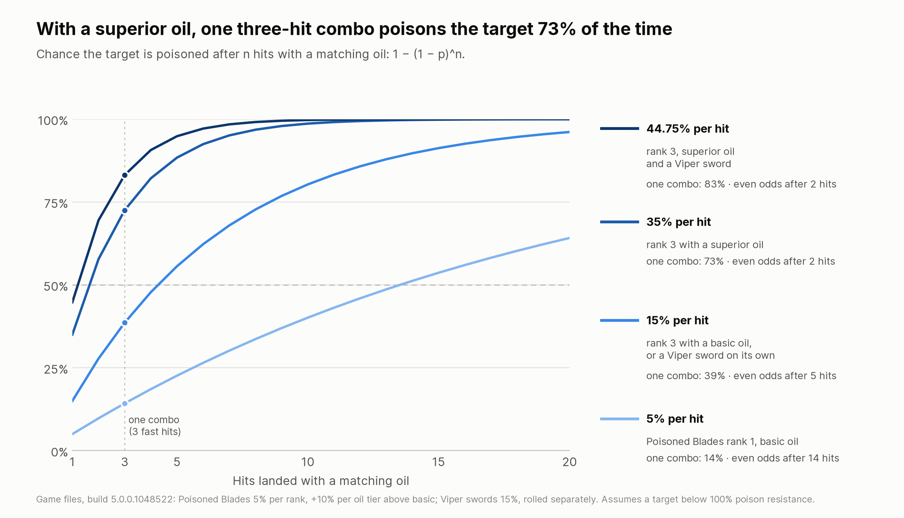

# 13. Viper: the School of the Viper

> Poisoned blades, from the first sword in White Orchard to the last chest in Borsodi's vault.

## Lore

The School of the Viper was founded by **Ivar Evil-Eye**'s faction after its failed coup within the Bear school. Ivar's secret aim was to defeat the Wild Hunt, and the school kept a large library about it. Its keep, **Gorthur Gvaed**, lay deep in the chasms of the Tir Tochair mountains, south of the Yaruga ([Witcher wiki: School of the Viper](https://witcher.fandom.com/wiki/School_of_the_Viper); [School of the Bear](https://witcher.fandom.com/wiki/School_of_the_Bear)).

Vipers were secretive. They took contracts on humans and nonhumans and killed for pay, but never openly took sides, which the Nilfgaardian Empire would not accept: when the Emperor failed to bring them under control, his army destroyed their keep. Their final test was to kill a pet they had raised. They fought with twin short blades called "fangs", with sinuous, unpredictable movement and fast, furious strikes, and relied on assassination and **poisoned blades**, drawing on their alchemy.

The Viper every player remembers is **Letho of Gulet**, the Kingslayer of *The Witcher 2*, who killed Kings Demavend and Foltest with his fellow Vipers Serrit and Auckes. In *The Witcher 3* he can return in *Ghosts of the Past*, which only appears if Letho survived the second game ([Witcher wiki: Letho](https://witcher.fandom.com/wiki/Letho); [Gamer Walkthroughs](https://gamerwalkthroughs.com/witcher-3-wild-hunt/velen/ghosts-of-the-past/)). Another Viper, Kolgrim, was wrongly blamed for a missing boy in White Orchard. The Viper armor and Venomous swords came with **Hearts of Stone**, and the largest known collection belongs to Countess Mignole, the noblewoman who sells you the diagrams.

## How it plays

A Viper wears medium armor, keeps the right oil on the blade at all times, and lands **as many hits as possible**, because every hit with an oil that matches the target is a roll for poison, and better oils roll higher. Once the target is poisoned, a **strong attack** cashes it in through Toxic Shock: the poison is used up for a burst of damage, at most once every five seconds. Debilitating Poison makes poisoned enemies hit you more softly, Potent Sting makes every hit with the matching oil harder, and Viper School Techniques adds Vitality and poison damage for every medium piece.

**Plenty of enemies can't be poisoned at all.** The game files give 100% poison resistance to arachas, endregas, all spiders, kikimores, drowners, hags, foglets, every kind of wraith, the Crones, elementals, golems, gargoyles, forktails, wyverns and basilisks, among others, and to **any enemy 20 or more levels above you**. A poison applied to them lasts zero seconds, so Toxic Shock has nothing to burst and Debilitating Poison never protects you ([chapter 19](19-the-maths.md#7-poison-how-many-hits-it-takes)). In those fights a Viper is a medium-armor swordsman with an oil bonus: Potent Sting and Hunter Instinct still work with the matching oil, and Strength Training still powers the strong attack. Plan your Sign and decoction support around that.

Patch 5.0 gave the school a skill line of its own: the four poison skills in the Alchemy tree are new ([witcherhour.com](https://witcherhour.com/skills/)). The research for this book found no published Remastered Viper build: VGTimes names Viper School Techniques but writes no build, and the builds from Gamestegy and Console Pulse predate 5.0 ([VGTimes](https://vgtimes.com/guides/169608-best-builds-in-the-witcher-3-remastered-skills-and-progression.html)). The plan below is built from the 5.0 tree.

## Skills by phase

Buy each table from the top down; every prerequisite is either already owned or listed higher up.

### Early game: the first 12 points (about level 12)

| Skill | Tree | Rank | Requires | Why |
| --- | --- | --- | --- | --- |
| Muscle Memory | Combat | 1 | start | After a dodge, your next fast attack deals +30% |
| Frenzy | Alchemy | 1 | start | The entry to the poison line; time slows before enemy counters while you have Toxicity |
| Viper School Techniques | General | 1 | start | +2% max Vitality and poison damage per medium piece |
| Poisoned Blades | Alchemy | 1 | Frenzy | Hits with an oil matching the target have a 5% chance to poison, plus 10 points with an enhanced oil or 20 with a superior one |
| Exploding Shield | Signs | 1 | start | Quen; reflects damage since 5.01 |
| Strength Training | Combat | 1 | Muscle Memory | Fast attacks power up the strong attack that cashes in the poison |
| Toxic Shock | Alchemy | 1 | Poisoned Blades | A strong attack on a poisoned target uses up the poison for a burst worth 25% of the hit; once every 5 s |
| Poisoned Blades | Alchemy | 2 | — | 10% |
| Three Strikes | Combat | 1 | Muscle Memory | 20% chance for +40–70% raw damage on the fourth consecutive same-style hit |
| Refreshment | Alchemy | 1 | start | Each potion dose heals 10% |
| Poisoned Blades | Alchemy | 3 | — | 15% with a basic oil, 35% with a superior one |
| Metabolic Control | General | 1 | Viper School Techniques | +10 max Toxicity; stepping stone to Synergy |

### Mid game: to 28 points (about level 30)

| Skill | Tree | Rank | Requires | Why |
| --- | --- | --- | --- | --- |
| Debilitating Poison | Alchemy | 1 | Toxic Shock | Poisoned enemies deal 5% less damage |
| Potent Sting | Alchemy | 1 | Debilitating Poison | Hits with the matching oil deal +5%; the target needn't be poisoned. Doubled against enemies whose template makes them immune to poison (chapter 19) |
| Toxic Shock | Alchemy | 3 | — | The burst grows to 75% of the hit |
| Hunter Instinct | Alchemy | 1 | Frenzy | +20% crit damage at full Adrenaline against the oiled monster type |
| Viper School Techniques | General | 3 | — | +6% max Vitality and poison damage per medium piece |
| Synergy | General | 1 | Metabolic Control | Mutagens 10% stronger |
| Razor Focus | Combat | 1 | Three Strikes | Start every fight with 1 Adrenaline |
| Muscle Memory | Combat | 2 | — | Two boosted fast attacks |
| Strength Training | Combat | 2 | — | +30% |
| Active Shield | Signs | 1 | Exploding Shield | Hold Quen; absorbed damage heals you |
| Debilitating Poison | Alchemy | 2 | — | 10% less damage taken from poisoned enemies |
| Potent Sting | Alchemy | 2 | — | +10% |
| Undying | Combat | 1 | Three Strikes | At 0 Vitality, spends Adrenaline to bring you back |
| Muscle Memory | Combat | 3 | — | Three boosted fast attacks |

### Late game: level 30+ and Blood and Wine

- **Rank 3:** Potent Sting (+15%, +30% against poison-immune enemies), Debilitating Poison (−15%), Hunter Instinct, Synergy, Metabolic Control, Strength Training.
- **Rank 2:** Razor Focus, Undying.
- **Acquired Tolerance → Tissue Transmutation** (Alchemy, from Hunter Instinct): room for decoctions, and Vitality while they run.
- **Mutation:** Euphoria, and later Metamorphosis (below).
- **Optional for crowds:** Fleet-Footed → Whirl (2 points from Undying). Every enemy a spin touches gets a poison roll. Whirl costs Stamina first and Adrenaline after, so keep spins short.

## Slots, mutagens and mutation

| Group | Skills | Mutagen |
| --- | --- | --- |
| 1 | Poisoned Blades, Toxic Shock, Potent Sting | Green |
| 2 | Debilitating Poison, Hunter Instinct, Active Shield | Green |
| 3 | Viper School Techniques, Metabolic Control, Synergy | Green (base bonus only) |
| 4 | Muscle Memory, Strength Training, Razor Focus | Red |
| Mutation slots (green) | Refreshment, Frenzy, Acquired Tolerance, Tissue Transmutation | — |

**Delusion:** if you want Axii's dialogue options, it takes Hunter Instinct's slot.

**Mutation: Euphoria first** (5 Ability Points, chapter 5): Toxicity becomes sword damage, and its extra slots take Alchemy skills. **Metamorphosis** is the capstone if you're investing in mutations anyway: applying a critical effect to an enemy starts a random crafted decoction for 120 seconds without any Toxicity, up to five at once. The game files confirm that the ordinary poison you apply triggers it, which makes it a natural fit for this school (chapter 19). Its research path costs 22 points in all, so it's a New Game+ or very-late-game goal. Gamestegy's pre-5.0 Viper build used it ([Gamestegy: Viper build](https://gamestegy.com/post/witcher-3/798/viper-build)).

## Consumables and the fight loop

**Oils, always.** Poisoned Blades only rolls when the oil matches the target's monster type, its chance grows with the oil's tier, and Hunter Instinct and Potent Sting also need the matching oil, so the right oil, enhanced or superior if you have it, matters three times over. **Potions:** Thunderbolt, Swallow, and Golden Oriole against enemies that poison *you* (the superior version even heals from it). **Decoctions:** Katakan for crits from the Venomous swords, and Ekimmara to heal through long fights.

**The loop:**

1. **Before the fight:** right oil, potions. Drinking anything switches Frenzy on.
2. **Open:** Quen.
3. **Roll for poison:** dodge in and land fast attacks. Muscle Memory makes them count.
4. **Cash it in:** once the target shows the poison effect, finish the string with a strong attack for Toxic Shock. The burst uses the poison up.
5. **Poison it again:** Debilitating Poison only protects you while the enemy carries your poison, so land fast hits before the next strong attack. Potent Sting adds damage to every hit with the matching oil either way.
6. **Wait out the cooldown:** Toxic Shock fires at most every five seconds, so use the gap to reposition and roll for the next poison.
7. **Against enemies that can't be poisoned,** skip steps 3 to 5: keep the matching oil on for Potent Sting and Hunter Instinct, fight with fast attacks into Strength Training finishers, and lean on Quen. Golems, elementals, spiders, kikimores, archespores and scolopendromorphs are flagged immune outright, so Potent Sting deals double against them; most of the others are only fully resistant, so it deals its normal bonus.

## Gear path

| Levels | Armor | Swords |
| --- | --- | --- |
| 1–2 | Starting armor | **Viper silver sword** (level 1: +10% poison chance, +10% Aard) and **Viper steel sword** (level 2: +15% poison chance), from *Scavenger Hunt: Viper School Gear* in White Orchard |
| 3–38 | Any medium armor: **Thousand Flowers** (7) or **White Tiger** (11) if your account has them, **Nilfgaardian** (10), then **Griffin**, **Wolven** or **Forgotten Wolven** | Keep the Viper swords until their damage falls too far behind, then whatever hits hardest |
| 39 | **Viper armor** (Hearts of Stone; medium; no set bonus, can't be upgraded). Chest: +50% poison resistance, +30% slashing and piercing, +40% elemental | **Viper Venomous** steel and silver (level 39): +15% poison chance, +10% crit chance, +75% crit damage, +25% Aard each |
| 40+ | Viper armor, or **Grandmaster Manticore** armor for its +5 Toxicity per piece once you run Euphoria | Keep the Venomous pair |

**Where the White Orchard swords are.** The silver sword's diagram is in the crypt under White Orchard's cemetery; the steel sword's is in the ruins west of the Ransacked Village. The garrison blacksmith can craft both ([Gamestegy: Viper silver sword](https://gamestegy.com/witcher-3/wiki/1302/viper-silver-sword-location-and-diagram); [Viper steel sword](https://gamestegy.com/witcher-3/wiki/1305/viper-steel-sword); [WitcherHour](https://witcherhour.com/how-to-get-the-viper-witcher-gear-hearts-of-stone/)).

**The Hearts of Stone pieces are all missable** (chapter 18):

- **Armor diagrams:** sold only by **Countess Mignole** at the auction house at the start of *Open Sesame!*. Buy all four before the auction ends; you can't go back.
- **Venomous steel sword diagram:** in a chest in the inner vault during the Borsodi heist. Loot every container before you leave.
- **Venomous silver sword:** no diagram exists. During *Whatsoever a Man Soweth…*, do the optional step with Shani and Professor Shakeslock, then choose to help Olgierd. In O'Dimm's riddle world, the sword is stuck in a stone behind a specter; take it before you solve the riddle.

Sources: [WitcherHour: Viper gear](https://witcherhour.com/how-to-get-the-viper-witcher-gear-hearts-of-stone/), [GameBanshee: Open Sesame!](https://www.gamebanshee.com/thewitcher3/walkthrough/opensesame.php), [GameBanshee: Whatsoever a Man Soweth](https://www.gamebanshee.com/thewitcher3/walkthrough/whatsoeveramansoweth.php), [Gamestegy: Viper armor](https://gamestegy.com/witcher-3/wiki/1400/viper-armor-diagram-stats-location).

**Why the armor is replaceable.** The Viper set has no set bonus at all, so the only reason to wear it is its stats. That frees the armor slot: any medium armor feeds Viper School Techniques. Two pre-5.0 Viper builds took the other route and used **Levity** (chapter 6) to turn the set light for Cat School Techniques. In 5.0 that route trades Viper School Techniques' poison damage and Vitality for Cat's fast-attack bonus alone, because Cat's crit-damage part adds nothing in the game's damage code (chapter 19). Keep Viper's own Technique ([Console Pulse: Viper build](https://www.consolepulse.com/multiplatform/the-witcher/guides/the-witcher-3-viper-build)).

## The maths



**How fast poison lands.** The game files set Poisoned Blades' chance at 5% per rank plus 10 points per oil tier above basic, and a poison sword rolls separately ([chapter 19](19-the-maths.md#7-poison-how-many-hits-it-takes)):

```math
p = 1 - (1 - p_{\mathrm{skill}})(1 - p_{\mathrm{sword}}),\qquad
P_{\text{poisoned}}(n) = 1 - (1 - p)^n
```

At rank 1 with a basic oil (5%), even odds take 14 hits, which is why poison is a long-fight tool early on. At rank 3 the oil makes the difference: 15% with a basic oil, but **35% with a superior one**, so three fast hits poison the target 73% of the time. Add a Venomous sword's separate 15% roll and it's 44.75% per hit, 83% after three.

**Why that matters for Toxic Shock.** Toxic Shock can fire only once every five seconds and uses the poison up, so the goal is to have the target poisoned again each time the cooldown ends. With a superior oil at rank 3, one string of three fast hits does that about three times in four. The poison itself lasts 5 seconds at base, scaled by your attack power, and deals 1.6% of the target's maximum health per second before resistances, so between bursts it's real damage too. Past that point, points do more in Potent Sting or Debilitating Poison.

**Who it can't touch.** Poison lasts `5 s × attack power × (1 − poison resistance)`, so the many monster families with 100% poison resistance, and every enemy 20 or more levels above you, shrug it off entirely. Separately, a shorter list of creature templates is flagged immune: golems, elementals, both expansions' spiders, kikimores, archespores, scolopendromorphs, the toad prince, Iris's nightwraith, the banshees, Dettlaff, Regis and the Caretaker. Only those count as "poison-immune" for Potent Sting's doubled bonus ([chapter 19](19-the-maths.md#7-poison-how-many-hits-it-takes)).

## Verdict

**Strengths.** The only school you can start in White Orchard with its own swords. 5.0's new poison line gives it a clear identity, Debilitating Poison is real defense, and the Venomous swords are among the best crit swords of Hearts of Stone.

**Weaknesses.** No set bonus at all, no Grandmaster tier, and every piece of its Hearts of Stone gear is missable. Poison is only reliable with the right oil for every enemy type, enhanced or superior if possible, so preparation is half the build. A long list of monster families, among them every wraith, drowner, hag, arachas and elemental, can't be poisoned at all, and neither can anything 20 levels above you. And by the endgame it looks a lot like a Manticore build with less Toxicity room.

**Who it suits:** players who like the fantasy of the Kingslayers, enjoy prepping oils for each fight, and want a build that's different from every guide out there.

## Sources

- [Witcher wiki: School of the Viper](https://witcher.fandom.com/wiki/School_of_the_Viper), [Letho](https://witcher.fandom.com/wiki/Letho), [Serrit](https://witcher.fandom.com/wiki/Serrit), [Scavenger Hunt: Viper School Gear](https://witcher.fandom.com/wiki/Scavenger_Hunt:_Viper_School_Gear), [Viper venomous silver sword](https://witcher.fandom.com/wiki/Viper_venomous_silver_sword)
- [witcherhour.com: Witcher 3 skills](https://witcherhour.com/skills/), [How to get the Viper gear](https://witcherhour.com/how-to-get-the-viper-witcher-gear-hearts-of-stone/)
- [VGTimes: Best builds in Remastered](https://vgtimes.com/guides/169608-best-builds-in-the-witcher-3-remastered-skills-and-progression.html)
- [Gamestegy: Viper build (pre-5.0)](https://gamestegy.com/post/witcher-3/798/viper-build), [Viper armor](https://gamestegy.com/witcher-3/wiki/1400/viper-armor-diagram-stats-location)
- [Console Pulse: Viper build (pre-5.0)](https://www.consolepulse.com/multiplatform/the-witcher/guides/the-witcher-3-viper-build)
- [GameBanshee: Open Sesame!](https://www.gamebanshee.com/thewitcher3/walkthrough/opensesame.php), [Whatsoever a Man Soweth](https://www.gamebanshee.com/thewitcher3/walkthrough/whatsoeveramansoweth.php)
- [Witcher wiki (games): Viper venomous steel sword](https://witcher-games.fandom.com/wiki/Viper_venomous_steel_sword)
- [Fextralife: Viper Steel Sword](https://thewitcher3.wiki.fextralife.com/Viper+Steel+Sword), [Potions](https://thewitcher3.wiki.fextralife.com/Potions)

<!-- nav -->

---

[← 12. Manticore: the School of the Manticore](12-manticore.md) · [Contents](../README.md) · [14. Verdict: which school is strongest? →](14-verdict.md)
