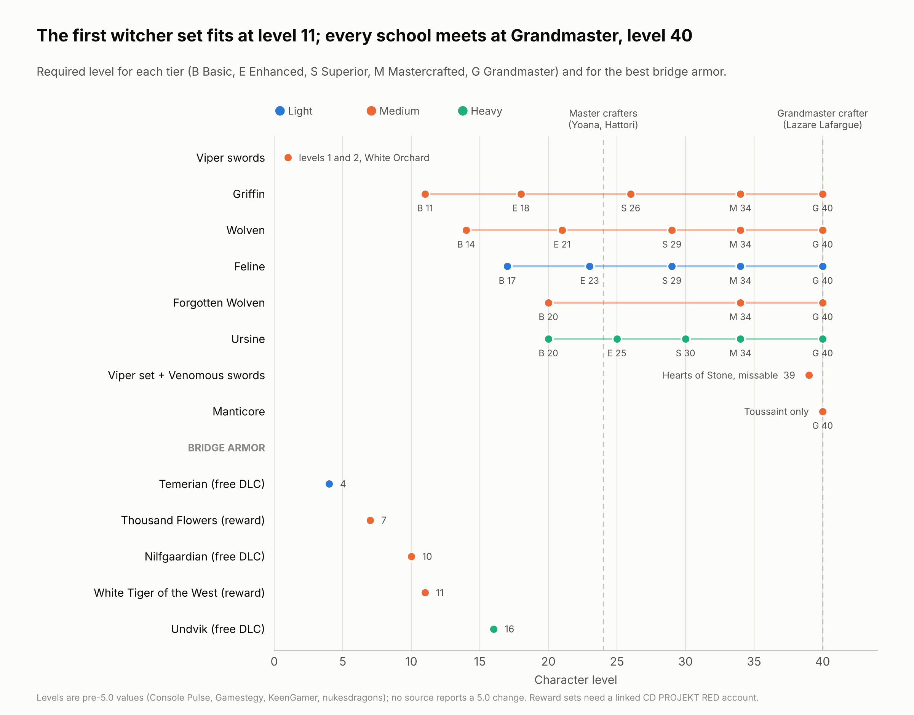

# 15. The gear path, region by region

This chapter follows the playthrough instead of the schools: what's worth picking up in each region, which witcher tiers to craft and when, and what each set is best used for. The school chapters already say which set each build wants; this is where it all sits on one timeline.

Three things stand out on the timeline:

- **The first witcher set fits at level 11** (Griffin). Before that, free DLC armor and the account reward sets fill the gap.
- **Every school meets at level 40.** All five Grandmaster tiers, and the whole Manticore set, are crafted by one man in Toussaint.
- **Master crafters appear at level 24.** Until then, nobody can make a Mastercrafted piece, whatever diagrams you hold.

Every level on the timeline matches the level the 5.0 game files compute for that item (chapter 19). The account reward sets were checked the same way where the files contain them.

## Rules for the whole playthrough

1. **Weight class first, set second.** Witcher sets give no bonus before Grandmaster (chapter 3), so mixing pieces from different sets costs nothing as long as each one has the weight your School Technique wants.
2. **You can't skip a tier, but you can wait.** Each recipe consumes the piece below it. Collect diagrams as you find them and craft when the upgrade is worth the materials.
3. **Never sell or dismantle a Mastercrafted piece** you intend to take to Grandmaster.
4. **Single runestones and glyphs move up with your gear; words don't.** Socket stones freely, and save runewords and glyphwords for your final pieces (chapter 6).
5. **Collect every diagram you pass, even for sets you won't wear.** In 5.0, owning an item or its diagram unlocks its look for **Reforge** at Yoana or Hattori, so you can wear the stats you need under the look you like ([KeenGamer](https://www.keengamer.com/articles/guides/witcher-3-remastered-patch-notes-skill-reset-reforge-and-major-changes/)).

## White Orchard (levels 1–4)

- **Viper swords.** *Scavenger Hunt: Viper School Gear* gives you the silver sword's diagram in the crypt under the cemetery (level 1: +10% poison chance, +10% Aard) and the steel sword's in the ruins west of the Ransacked Village (level 2: +15% poison chance). The garrison blacksmith crafts both. They're the first witcher gear in the game ([Gamestegy](https://gamestegy.com/witcher-3/wiki/1302/viper-silver-sword-location-and-diagram)).
- **Temerian armor** (free DLC): talk to Bram at Woesong Bridge. Light, level 4, with Roach gear included. The best opener for a Feline, and it can't be missed ([Console Pulse](https://www.consolepulse.com/multiplatform/the-witcher/guides/the-witcher-3-rare-armors)).

## Vizima: the reward chest

Right after White Orchard, the Royal Palace in Vizima has a chest with your **CD PROJEKT RED account rewards**: the **Scarlet Crest** set (new in Remastered, level 40) and, if your account has them, **Armor of a Thousand Flowers** (level 7) and **White Tiger of the West** (level 11) with their swords. The two older sets are medium armor that arrives before any witcher set, and their swords carry crit bonuses. Chapter 16 explains what linking an account means and how to claim them.

## Velen and Novigrad (levels 5–25)

| Pickup | Level | Where | Who it's for |
| --- | --- | --- | --- |
| **Nilfgaardian** set (free DLC, medium) | 10 | Crow's Perch quartermaster | Every medium school until Griffin |
| **Griffin** Basic, Enhanced | 11, 18 | Velen; Enhanced also in the Novigrad outskirts | Griffin, Wolven, Manticore, Viper (any medium build) |
| **Feline** Basic, Enhanced, Superior | 17, 23, 29 | Velen, Novigrad, Oxenfurt; Mad Kiyan guards the Basic diagrams | Feline |
| **Forgotten Wolven** Basic (all six diagrams) | 20 | *In the Eternal Fire's Shadow* starts with the Eternal Fire priest at Devil's Pit (quest level 15); the spirit Reinald hands over the diagrams. Finish it before the Isle of Mists to be safe (chapter 18) | Wolven |
| **Ursine** Superior, Mastercrafted | 30, 34 | Velen | Ursine (after Skellige's Basic and Enhanced) |
| **Moonblade** (relic silver: Yrden, crit damage, 3 slots) | scales | Underwater chest in the Pontar, southwest of Mulbrydale | Early Sign or crit builds |
| **Gwyhyr** (relic steel: Yrden, crit damage, armor piercing, bleed) | — | Cave northwest of Hanged Man's Tree | A stopgap; not top-tier |
| **Arbitrator** (crafted relic steel, +50% crit damage, 10% stagger chance) | 17 | Needs a **Master** blacksmith (game files), so in practice Hattori after *Of Swords and Dumplings*; the diagram's location isn't confirmed | Crit builds from about level 24 |
| **Bloodsword** (relic silver, crit and bleed) | — | Chest at the end of *Inheritance* | Crit builds |

**Unlock your Master crafters at level 24.** **Yoana**, the armorer at Crow's Perch, after *Master Armorers*, and **Hattori**, the Novigrad blacksmith, after *Of Swords and Dumplings*. They're the only Master crafters (later, Lazare Lafargue can make any tier) and the only ones who offer Reforge ([Gamertagmythras](https://gamertagmythras.com/blog/the-witcher-3/witcher-3-crafting-guide); [KeenGamer](https://www.keengamer.com/articles/guides/witcher-3-remastered-patch-notes-skill-reset-reforge-and-major-changes/)).

Location guides: Mobalytics has one for each of Cat, Griffin, Ursine, Wolven and Manticore gear (linked from those chapters, [Cat](https://mobalytics.gg/gamebase/guides/witcher-3-how-to-get-cat-school-gear-set) for example), Console Pulse has per-school gear guides, and the Viper and Forgotten Wolven guides are on [WitcherHour](https://witcherhour.com/how-to-get-the-viper-witcher-gear-hearts-of-stone/) and [Fextralife](https://thewitcher3.wiki.fextralife.com/Scavenger+Hunt:+Forgotten+Wolf+School+Gear+Diagrams).

## Skellige (levels 15–34)

| Pickup | Level | Where | Who it's for |
| --- | --- | --- | --- |
| **Undvik** set (free DLC, heavy, no sockets) | 16 | Kaer Trolde armorer | Ursine until its own set |
| **Ursine** Basic, Enhanced | 20, 25 | Skellige; a ballad in the An Skellig dungeon tells Gerd's story | Ursine |
| **Griffin** Superior, Mastercrafted | 26, 34 | Skellige | Griffin and other medium builds |
| **Feline** Mastercrafted | 34 | Skellige | Feline |
| **Wolven** Superior and Mastercrafted diagrams | 29, 34 | Skellige (with Kaer Morhen and Velen) | Wolven |
| **Hjalmar's steel sword** | — | Win the fistfight in Hjalmar's corner of the Kaer Trolde feast hall during *King's Gambit*, before you go to Crach. Missable | Collectors |
| **Winter's Blade** (relic steel, levels with you since 4.0) | scales | Ask Crach an Craite during *Brothers in Arms: Skellige*; guides say to do it before you sail to the Isle of Mists (chapter 18). Missable | Crit builds |

## Kaer Morhen (from the main quest *Ugly Baby*)

Kaer Morhen only opens up after *Ugly Baby*. Two sets live here:

- **Wolven:** the Basic armor diagrams (level 14) are here, along with Enhanced and Superior diagrams, so the Wolven set realistically arrives mid-game.
- **Forgotten Wolven:** Osmund's notes and Vesemir's note, on the upper bookcase in the main hall (climb the ladder), hold the Mastercrafted diagrams and, with Blood and Wine, the Grandmaster ones.

## Hearts of Stone (levels 30–39)

| Pickup | Level | Where | Who it's for |
| --- | --- | --- | --- |
| **The Runewright** (enchanting) | — | Upper Mill; 30,000 crowns for all three tiers (chapter 6) | Everyone |
| **Ofieri** set (crafted, light; Quen, Yrden and Axii intensity) | 38 (one source says 35) | Four diagrams in the far Novigrad outskirts during *From Ofier's Distant Shores*; Dulla kh'Amanni at Upper Mill translates them | Sign builds that don't need medium armor |
| **Ofieri saber** (crafted relic steel: crit, Igni, Aard, Axii) | 38 | Diagram sold by Dulla kh'Amanni | Feline, Griffin |
| **New Moon** set (relic, medium; crit chance and crit damage) | 34–36 | Crane Cape lighthouse, Kilkerinn Ruins, a crypt in the far outskirts, and Vikk Watchtower during *The Royal Air Force* | Crit builds with Levity or in medium armor |
| **Viper** armor, **Venomous** swords | 39 | Auction and vault in *Open Sesame!*; O'Dimm's world in *Whatsoever a Man Soweth…*. Missable | Viper; the swords suit any crit build |
| **Iris** (relic steel: strong attacks hit twice) | 37 | Olgierd gives it to you if you save him. Missable | Ursine |

Sources: [nukesdragons: Ofieri armor](https://nukesdragons.com/witcher-3/db/armor/ofieri-scale-armor), [WitcherHour: Best armor](https://witcherhour.com/witcher-3-best-armor/), [GoSuNoob: Ofieri armor](https://www.gosunoob.com/witcher-3/ofieri-armor-locations/).

## Toussaint (levels 35+)

**The Grandmaster craftsman.** **Lazare Lafargue** in Hauteville, Beauclair, is the only Grandmaster smith and armorer in the game. Take the "Contract: Grandmaster Armorer" notice in Beauclair to start *Master Master Master Master!* (suggested level 40), and ask him about the five vanished witchers to open the Grandmaster hunts for Feline, Griffin, Manticore, Ursine and Wolven. Every Grandmaster recipe except Manticore's needs the matching Mastercrafted piece ([GameBanshee](https://gamebanshee.com/thewitcher3/walkthrough/mastermastermastermaster.php); [Console Pulse](https://consolepulse.com/multiplatform/the-witcher/guides/witcher-3-grandmaster-gear-sets-bonuses-compared)). Forgotten Wolven's Grandmaster diagrams are in the Kaer Morhen notes instead.

| Pickup | Level | Where | Who it's for |
| --- | --- | --- | --- |
| **Grandmaster** Feline, Griffin, Ursine and Wolven, and the **Manticore** set | 40 | Lafargue's hunts | Everyone |
| **Tesham Mutna** set (heavy; kills heal you with 3+ pieces) | 39 | Only during *La Cage au Fou*. Missable | Ursine |
| **Hen Gaidth** set *or* **Toussaint relic** set (both heavy) | 40+ | One or the other, depending on your route in *The Night of Long Fangs* (chapter 18) | Ursine |
| **Toussaint Ducal Guard Captain's** set (crafted, medium, +400 Vitality) | 45 | Diagrams in the Bastoy reward chest, Antoine Straggen's bed at the Arthach Palace Ruins, and a barghest-guarded chest between the Cockatrice Inn and Flovive | Medium builds that want Vitality |
| **Toussaint Knight's Tourney** set (crafted, heavy, +500 Vitality) | 48 | Diagram from *The Curse of Carnarvon* | Ursine |
| **Toussaint Knight's Steel Sword** (crafted: +20% crit chance, +100% crit damage, +300 armor piercing) | 48 | Antoine Straggen's chest, upper floor of the central tower at the Arthach Palace Ruins | Every sword build |
| **Aerondight** (relic silver: charges up, then every hit crits) | scales | *There Can Be Only One* (chapter 17) | Every sword build |
| **Gesheft** (crafted silver: crit, Aard), **Belhaven Blade** (steel: crit, Aard), **Black Unicorn** (steel: Aard, bleed) | 45–46 | Werewolf den north of Basane Farm; a river chest in the Sansretour; three diagram spots | Crit and Aard builds |

Sources: [nukesdragons](https://nukesdragons.com/witcher-3/db/weapons/toussaint-knights-steel-sword), [Console Pulse: Non-witcher armor](https://consolepulse.com/multiplatform/the-witcher/guides/witcher-3-non-witcher-armor-sets-unique-outfits), [Console Pulse: Rare armors](https://www.consolepulse.com/multiplatform/the-witcher/guides/the-witcher-3-rare-armors), [WitcherHour: Best weapons](https://witcherhour.com/witcher-3-best-weapons/).

## Set by set: what each witcher set is for

| Set | Weight | Best for | Worth crafting from | At Grandmaster | Pair with |
| --- | --- | --- | --- | --- | --- |
| **Griffin** | Medium | Sign builds; also the early medium armor for every medium school | Basic (11): it's the first witcher armor you can wear | All six pieces: the 6-piece bonus is the build | Its own swords |
| **Wolven** | Medium | Bleed-focused sword builds | Whatever tier is current when Kaer Morhen opens | Six if you build around bleeding; otherwise skip for Forgotten Wolven | Its own swords for the bleed bonus |
| **Forgotten Wolven** | Medium | Sword-and-Sign hybrids | Basic (20) | All six: Aard bonus against enemies in Yrden | Its own swords |
| **Feline** | Light | Fast attacks and crits | Basic (17) | Four armor pieces for the 3-piece bonus; the 6-piece bonus costs Adrenaline | Toussaint Knight's Steel Sword and Aerondight |
| **Ursine** | Heavy | Tanks, strong attacks, Quen | Basic (20) | All six for the Quen bonuses | Its own swords, or Iris without the 6-piece |
| **Manticore** | Medium | Alchemy, decoctions, bombs | Grandmaster only (40) | All six: +1 charge on every alchemy item | Its own swords |
| **Viper** | Medium | Poison | Swords at level 1; armor at 39 | No Grandmaster tier or bonus | Venomous swords |

The Grandmaster bonuses themselves are in chapter 3. Two are disputed between sources (Forgotten Wolven and Ursine), so read the tooltip before you spend the materials.

## Your school's gear track

| School | Levels 1–10 | 11–20 | 21–33 | 34–39 | 40+ |
| --- | --- | --- | --- | --- | --- |
| **Feline** | Temerian | Light armor you find; Feline Basic at 17 | Feline Enhanced, Superior | Feline Mastercrafted | Grandmaster Feline armor, relic swords |
| **Griffin** | Thousand Flowers or Nilfgaardian | Griffin Basic, Enhanced | Griffin Superior | Griffin Mastercrafted | Grandmaster Griffin, six pieces |
| **Ursine** | Any heavy armor | Undvik at 16; Ursine Basic at 20 | Ursine Enhanced, Superior | Ursine Mastercrafted; Iris | Grandmaster Ursine, or Tourney armor |
| **Wolven** | Thousand Flowers or Nilfgaardian | Griffin Basic, Enhanced; Forgotten Wolven at 20 | Forgotten Wolven or Wolven | Forgotten Wolven Mastercrafted | Grandmaster Forgotten Wolven, six pieces |
| **Manticore** | Thousand Flowers or Nilfgaardian | Griffin | Griffin, Wolven or Forgotten Wolven | Mastercrafted medium set | Grandmaster Manticore, six pieces |
| **Viper** | Viper swords; any medium armor | Medium armor | Medium armor | Viper armor and Venomous swords (39) | Viper or Grandmaster Manticore armor |

## Sources

- [Console Pulse: Grandmaster gear sets compared](https://consolepulse.com/multiplatform/the-witcher/guides/witcher-3-grandmaster-gear-sets-bonuses-compared), [Rare armors](https://www.consolepulse.com/multiplatform/the-witcher/guides/the-witcher-3-rare-armors), [Non-witcher armor sets](https://consolepulse.com/multiplatform/the-witcher/guides/witcher-3-non-witcher-armor-sets-unique-outfits)
- Console Pulse gear guides: [Feline](https://www.consolepulse.com/multiplatform/the-witcher/guides/witcher-3-feline-gear-guide), [Griffin](https://www.consolepulse.com/multiplatform/the-witcher/guides/witcher-3-griffin-gear-guide), [Wolf](https://consolepulse.com/multiplatform/the-witcher/guides/witcher-3-wolf-school-gear-guide), [Forgotten Wolf](https://consolepulse.com/multiplatform/the-witcher/guides/the-witcher-3-forgotten-wolf-school-gear-guide), [Ursine](https://consolepulse.com/multiplatform/the-witcher/guides/the-witcher-3-ursine-gear), [Manticore](https://consolepulse.com/multiplatform/the-witcher/guides/witcher-3-manticore-gear-guide)
- Mobalytics location guides: [Cat](https://mobalytics.gg/gamebase/guides/witcher-3-how-to-get-cat-school-gear-set), [Griffin](https://mobalytics.gg/gamebase/guides/witcher-3-how-to-get-griffin-school-gear-set), [Ursine](https://mobalytics.gg/gamebase/guides/witcher-3-how-to-get-ursine-school-gear-set), [Wolven](https://mobalytics.gg/gamebase/guides/witcher-3-how-to-get-wolven-school-gear-set), [Manticore](https://mobalytics.gg/gamebase/guides/witcher-3-how-to-get-manticore-gear-set)
- [Gamestegy: Blacksmith locations](https://gamestegy.com/post/witcher-3/781/blacksmith-locations)
- [Gamertagmythras: Crafting guide](https://gamertagmythras.com/blog/the-witcher-3/witcher-3-crafting-guide)
- [GameBanshee: Master Master Master Master!](https://gamebanshee.com/thewitcher3/walkthrough/mastermastermastermaster.php)
- [KeenGamer: Remastered patch notes, Reforge](https://www.keengamer.com/articles/guides/witcher-3-remastered-patch-notes-skill-reset-reforge-and-major-changes/)
- [WitcherHour: Best armor](https://witcherhour.com/witcher-3-best-armor/), [Best weapons](https://witcherhour.com/witcher-3-best-weapons/)
- [nukesdragons: Witcher 3 database](https://nukesdragons.com/witcher-3/db/armor/temerian-armor)

<!-- nav -->

---

[← 14. Verdict: which school is strongest?](14-verdict.md) · [Contents](../README.md) · [16. Other armor sets: reward sets, free DLC and the expansions →](16-other-armor.md)
