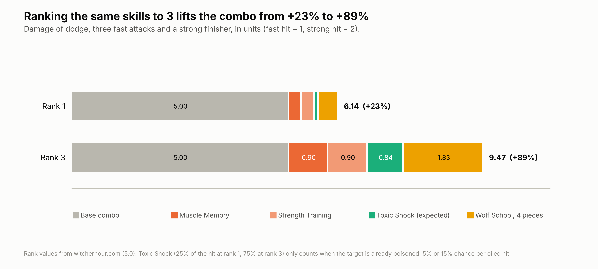
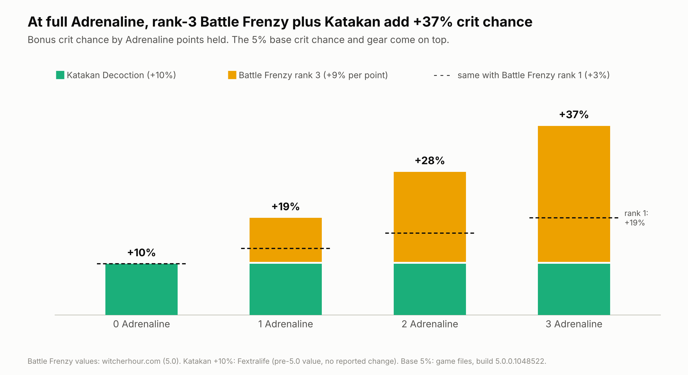
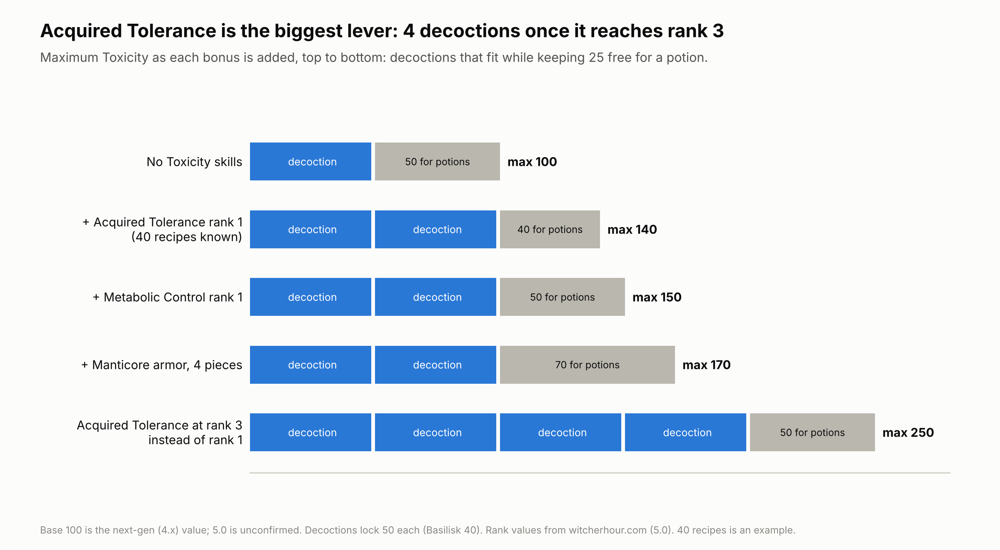
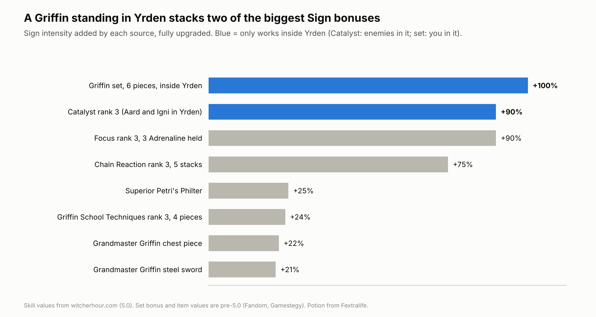
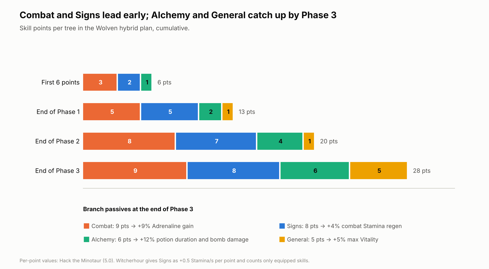

# 19. The maths behind the choices

This chapter collects every calculation in the book in one place, with the assumptions spelled out. The school chapters use these results; here you can check the working.

## Ground rules

- **Only published numbers go in.** Skill values come from the 5.0 community databases ([witcherhour.com](https://witcherhour.com/skills/) for all three ranks, [WitcherDB](https://witcherdb.com/build-planner) and [Hack the Minotaur](https://hacktheminotaur.com/the-witcher-3/the-witcher-3-remastered-new-skill-trees-guide/) for rank 1). Item and potion values are pre-5.0 unless marked, because no 5.0 note changes them.
- **Where the game hides a number, the model uses units or bounds.** Base hit damage, base crit chance and base crit damage aren't published, so damage is measured in units of a normal hit, and crit results are given as "at least" figures.
- **Bonuses of the same kind are assumed to add.** That's how the game's character screen presents them (one Sign intensity figure, one Vitality figure), but no source states the formula for every combination.
- **The tooltip wins.** If your game shows a different number, use it.

## 1. A basic combo: why ranks beat breadth



The combo is a dodge, three fast attacks and a strong finisher. A fast hit is 1 unit and a strong hit 2 (an assumed ratio), so the base is 5 units:

```math
D = 3F + S + m\,n\,F + s\,S + t\,(1+s)\,S\,P_3
```

```math
D_{\text{final}} = D \times (1 + w \times \text{pieces})
```

| Symbol | Meaning | Rank 1 | Rank 3 |
| --- | --- | --- | --- |
| `m`, `n` | Muscle Memory: +30% on the next `n` fast attacks | 0.30, 1 | 0.30, 3 |
| `s` | Strength Training bonus on the strong attack | 0.15 | 0.45 |
| `t` | Toxic Shock burst, as a share of the strong hit | 0.25 | 0.75 |
| `P_3` | Chance the target is poisoned by the finisher (three oiled hits) | 14% (5% per hit) | 39% (15% per hit) |
| `w` | Wolf School Techniques per medium piece (four pieces) | 0.02 | 0.06 |

**Result:** +23% at rank 1, +89% at rank 3, for the same five skills. Ranking a core skill is usually worth more than buying a new one at rank 1. Three Strikes and Melt Armor aren't modeled because their effect sizes aren't published.

## 2. School Techniques on the same combo

At rank 3 with four matching pieces, here's what each Technique adds to the rank-3 combo above (7.64 units before the Technique):

| Technique | What it boosts here | Units added | Also gives |
| --- | --- | --- | --- |
| **Wolf** | All weapon damage +24% | +1.83 | +24% Sign intensity |
| **Manticore** | All sword damage +24% | +1.83 | +24% bomb damage |
| **Cat** | Fast attacks +24% | +0.94 | +96% crit damage (see section 3) |
| **Bear** | The strong finisher +24% | +0.70 to +0.90 | +24% max Vitality |
| **Griffin** | Nothing on the sword | 0 | +24% Sign intensity, +4 Stamina per second |
| **Viper** | Only poison damage | about 0 | +24% max Vitality |

Wolf and Manticore tie on the sword; Wolf spends its second bonus on Signs, Manticore on bombs. Cat looks weak until crits enter the picture, which is the next section. The "Also gives" column is why the comparison only makes sense inside a build: Griffin adds nothing to this combo and is still the best Technique for a caster.

## 3. Crits: what chance is worth



If a crit deals `1 + d` times a normal hit, raising crit chance by `Δc` adds this much to the average hit, measured in normal hits:

```math
\Delta \bar{D} = \Delta c \times d
```

Base crit damage isn't published, but Cat School Techniques at rank 3 on four light pieces guarantees `d ≥ 0.96`. So the Feline stack of +37% crit chance (Battle Frenzy rank 3 at a full bar, plus Katakan) is worth **at least 0.35 of a normal hit per swing**. Against the oiled monster type at full Adrenaline, Hunter Instinct rank 3 raises `d` by another 0.60, and the floor becomes **0.57 of a normal hit**. Crit chance and crit damage multiply each other, which is why a crit build wants both rather than more of one (chapter 8).

## 4. Adrenaline: the Undying floor

Undying restores 10% Vitality per Adrenaline point when you'd die. Razor Focus guarantees one point at the start of every fight, so Undying has at least that much to work with when a fight opens (hits, Rend and Whirl can still empty the bar later):

| Adrenaline held | Vitality restored by Undying |
| --- | --- |
| 1 (fight start, with Razor Focus) | 10% |
| 2 | 20% |
| 3 (full bar) | 30% |

Without Razor Focus, the first big hit of a fight can kill you with Undying sitting empty, which is why the plans buy Razor Focus before Undying or alongside it. The rank 2 and 3 values carry an extra "33% / 67% bonus" that no source explains.

## 5. Effective health: Ursine with Mutated Skin

How long you last scales with Vitality divided by the share of each hit that reaches it. With Bear School Techniques rank 3 on four heavy pieces (+24%) and Survival Instinct rank 3 (+24%):

```math
\text{effective health} = \frac{1 + 0.24 + 0.24}{1 - 0.15 \times \text{Adrenaline held}}
```

| Adrenaline held | Damage taken | Effective health vs no bonuses |
| --- | --- | --- |
| 0 | 100% | 1.48× |
| 1 | 85% | 1.74× |
| 2 | 70% | 2.11× |
| 3 | 55% | 2.69× |

A full bar nearly doubles how long you last compared with an empty one (2.69 against 1.48), which is the trade-off against spending the same three points on a rank-3 Rend (+90% on one strike). Chapter 10.

## 6. The Toxicity budget and Euphoria



Each decoction locks 50 Toxicity until it ends, so:

```math
\text{decoctions} = \left\lfloor \frac{\text{max Toxicity} - \text{room for potions}}{50} \right\rfloor
```

```math
\text{max Toxicity} = 100 + a \times \text{recipes known} + 10\,k + 5 \times \text{Manticore pieces}
```

where `a` is Acquired Tolerance's rank (+1/2/3 per recipe) and `k` is Metabolic Control's rank (+10/20/30). The base of 100 and Manticore's +5 per piece are next-gen values (older sources give other armor numbers); 5.0's aren't confirmed. At 40 recipes, rank-3 Acquired Tolerance alone adds 120, more than any other source.

**Euphoria** adds 0.75% sword damage and Sign intensity per Toxicity point, so each decoction held is worth +37.5% (+75% for two, +150% for four). Sources disagree on the cap (a flat 75%, or rising with your maximum), and two guides report that 5.0 weakened it, so treat those as upper bounds. Chapter 12.

## 7. Poison: how many hits it takes


```math
P_{\text{poisoned}}(n) = 1 - (1 - p)^n
```

| Chance per hit | After 3 hits | After 6 hits | Hits for even odds |
| --- | --- | --- | --- |
| 5% (Poisoned Blades rank 1) | 14% | 26% | 14 |
| 15% (rank 3, or the Viper steel sword alone) | 39% | 62% | 5 |
| 30% (rank 3 plus a Venomous sword, if they add) | 66% | 88% | 2 |

If the sword's roll and the skill's roll are separate, the combined chance is 1 − 0.85 × 0.85 ≈ 28% rather than 30%; no source confirms which. Toxic Shock fires at most every 5 seconds, so poison chance beyond what you need to have the target poisoned each cooldown only adds damage over time. Chapter 13.

## 8. Sign intensity



The two largest bonuses need Yrden: Catalyst only counts against enemies inside it, and the Griffin set bonus only while you stand in your own trap. Focus needs a full bar, and Chain Reaction five casts in a row, each a different Sign from the one before. The flat sources (potion, Technique, armor, sword) are what you have in every fight. Chapter 9.

## 9. Branch passives

Every point you spend earns its tree a small passive: Combat +1% Adrenaline gain, Signs +0.5% combat Stamina regeneration, Alchemy +2% potion duration and bomb damage, General +1% Vitality ([Hack the Minotaur](https://hacktheminotaur.com/the-witcher-3/the-witcher-3-remastered-new-skill-trees-guide/)). They're small per point but they make stepping-stone skills worth something.



Sources disagree on two details: witcherhour gives the Signs bonus as +0.5 Stamina per second rather than +0.5%, and says only equipped skills count toward the passives, while Hack the Minotaur counts every point (chapter 21).

## What nobody has published yet

These numbers would sharpen every calculation above, and no source has them for 5.0:

- base crit chance and base crit damage;
- the damage ratio between fast and strong attacks;
- how armor piercing is calculated;
- how fast potion Toxicity drains, and the 5.0 base maximum;
- out-of-combat Stamina regeneration;
- the total number of skill points in a full playthrough;
- the size of Three Strikes' boost, Melt Armor's armor reduction and Aftershock's damage.

## Sources

- [witcherhour.com: Witcher 3 skills](https://witcherhour.com/skills/)
- [WitcherDB: Remastered build planner](https://witcherdb.com/build-planner)
- [Hack the Minotaur: New skill trees](https://hacktheminotaur.com/the-witcher-3/the-witcher-3-remastered-new-skill-trees-guide/)
- [KeenGamer: All mutations](https://www.keengamer.com/articles/guides/the-witcher-3-remastered-all-mutations-how-to-unlock-them/)
- [Fextralife: Decoctions](https://thewitcher3.wiki.fextralife.com/Decoctions), [Katakan Decoction](https://thewitcher3.wiki.fextralife.com/Katakan+Decoction), [Potions](https://thewitcher3.wiki.fextralife.com/Potions)
- [Console Pulse: Toxicity, overdose and Delayed Recovery](https://consolepulse.com/multiplatform/the-witcher/guides/witcher-3-toxicity-overdose-delayed-recovery-guide)
- [Gamestegy: Grandmaster Griffin armor](https://gamestegy.com/witcher-3/wiki/1335/grandmaster-griffin-armor)

<!-- nav -->

---

[← 18. Missables: one-time gear](18-missables.md) · [Contents](../README.md) · [20. Common mistakes, and how to respec →](20-mistakes-and-respec.md)
